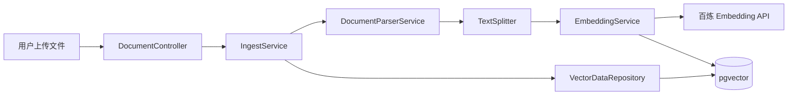

## 用户需求
按照 `06_功能清单进度文档.md` 的 P0 优先级，实现第一个未完工任务：文档入库流水线。

## 产品概述
打通 RAG 核心链路的数据入口——用户上传 PDF/TXT 文档到指定知识库，系统自动完成文本解析、智能分块、向量嵌入（调用百炼 Embedding API），并将分块内容和向量存入 PostgreSQL（pgvector），为后续检索和问答提供数据基础。

## 核心功能
- **文档上传**：通过管理接口 `POST /api/kb/{kbId}/documents` 上传文件，支持 TXT 和 PDF 格式
- **文本解析**：PDF 用 Apache PDFBox 提取文本，TXT 按 UTF-8 直接读取
- **智能分块**：按 400 字符 + 100 字符重叠进行固定大小分块，以段落和句子边界优化切分
- **向量化入库**：调用百炼 text-embedding-v2 模型（1536 维）批量生成向量，写入 pgvector
- **状态追踪**：文档状态从 PENDING → PROCESSING → COMPLETED（成功）或 FAILED（失败），供前端轮询
- **文档列表**：`GET /api/kb/{kbId}/documents` 查看知识库下所有文档及状态
- **多租户隔离**：所有数据写入时携带 kbId + tenantId，与现有安全体系一致

## 技术栈选择

| 层面 | 技术 | 理由 |
|------|------|------|
| 向量数据库 | pgvector + `com.pgvector:pgvector:0.1.6` | 与现有 vector(1536) 列原生结合，支持 `<=>` 余弦相似算子 |
| AI 服务 | 阿里云百炼 DashScope（OpenAI 兼容模式） | 用户已提供 API Key，Base URL 兼容 OpenAI SDK |
| HTTP 客户端 | Spring RestTemplate（spring-boot-starter-web 内置） | 无需额外依赖，项目已引入 web starter |
| 文档解析 | Apache PDFBox 2.0.31（仅 PDF）+ Java IO（TXT） | 轻量级，避免 Tika 的复杂依赖 |
| 分块策略 | 固定大小 + 重叠 + 句子边界优化 | 400 字符/块、100 字符重叠，中文友好 |
| 类型转换 | JPA AttributeConverter + Hibernate TypeContributor | 将 PGvector 与 Java float[] 双向映射 |

## 实现方案

### 整体数据流

### 分块策略细节

采用固定大小分块 + 段落/句子边界优化的混合策略：
1. 先按 `\n\n` 拆段，段内按 `。！？!?` 拆句
2. 逐句拼接，直到累积长度 ≥ 400 字符或遇到段尾
3. 每个 chunk 与前一个 chunk 重叠最后 100 字符
4. 单个 chunk 不超过 500 字符（硬上限）
5. 不足 400 字符且无后续内容的独立成块

### Embedding 批量调用

百炼 text-embedding-v2 支持单次请求发送多个文本（input 数组），减少 HTTP 往返：
- 每批最多 25 个 chunk（百炼建议批大小）
- 批量发送 → 等待响应 → 解析所有向量 → 批量写入 DB
- 单次 API 调用 ~2-5 秒完成 25 个 chunk 的向量化

### pgvector 类型集成

核心思路：引入 `com.pgvector:pgvector:0.1.6`，通过 Hibernate TypeContributor 注册 PGvector 类型，Entity 字段使用 `PGvector` 类型（非 String），配合 JPA AttributeConverter 实现 float[] ↔ PGvector 的双向转换。

### 性能评估

- 文档解析（PDFBox）：~500ms/10 页 PDF
- 分块：~10ms/文档
- Embedding（批量 25 个/次）：~2s/批次
- DB 写入：~50ms/批次
- 典型 50 页 PDF（约 100 个 chunk）：总耗时约 10-15 秒（同步模式）

### 避免的坑

1. **PDFBox 中文乱码**：需指定 UTF-8 编码读取
2. **超大文件**：已配置 `max-file-size: 50MB`，超标时 Spring 自动拒绝
3. **API Key 安全**：配置在 application.yml 中（不硬编码），不打印到日志
4. **VectorData 类型迁移**：不改 SQL DDL，只改 Java Entity 字段类型 + 类型转换器

## 实现笔记

### 执行要点

- **RestTemplate Bean**：创建 `BailianConfig` 配置类，注入 `RestTemplate` Bean + `@ConfigurationProperties` 绑定百炼参数
- **PGvector 类型注册**：使用 `META-INF/services/org.hibernate.boot.model.TypeContributor` + 自定义 `PGvectorTypeContributor`，确保 Hibernate 能识别 PGvector 类型
- **文件大小验证**：Controller 层在 `@RequestParam MultipartFile` 前加 `@Valid` 校验
- **状态机**：Document 状态为 PENDING → PROCESSING（开始处理时更新）→ COMPLETED/FAILED（结束时更新），使用 `@Transactional` 保证原子性
- **日志规范**：使用 SLF4J（项目已有），关键节点（上传、解析、分块、embedding 调用、写入完成）打印 INFO 日志，API 调用失败打印 ERROR 日志

### 性能注意

- 批量 embedding 调用减少 HTTP 往返（热点路径）
- 批量 saveAll 减少 DB 往返
- 事务粒度控制在单文档级别（不跨文档）

### 向后兼容

- 不改 `sql/init.sql` DDL
- 不改现有实体字段名
- DocumentController 新增路径不影响现有 RagAdminController
- KB 物理清理（purge）已包含 vector_data 删除，无需额外修改

## Agent Extensions

### SubAgent
- **code-explorer**
  - 用途：在实现过程中快速定位跨文件的依赖关系、验证 API 签名和类型定义
  - 预期结果：确认 Repository 方法签名、实体字段映射、现有拦截器注册方式等
