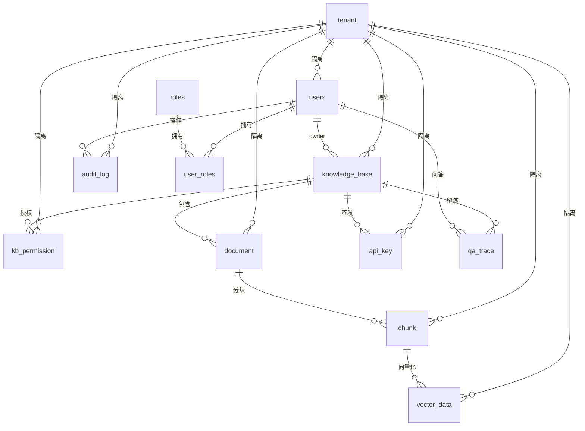

# qoorag 数据架构设计文档（Data Architecture）

> 版本：v0.1（草稿）
> 创建日期：2026-07-20
> 状态：设计中 / 待评审
> 4A 架构定位：业务架构（02）→ 数据架构（Data）→ 应用架构（04）→ 技术架构（05）
> 关联文档：
> - 业务架构：`.docs/02_业务架构设计文档.md`
> - 应用架构：`.docs/04_应用架构设计文档.md`
> - 技术架构：`.docs/05_技术架构设计文档.md`
> - 建表/索引/种子/RLS 模板实现：`./sql/init.sql`
> 说明：本文档定义"数据如何组织与治理"——数据分类、概念/物理模型、多租户隔离、数据分级、数据生命周期，是应用架构与数据库详细设计（03.x）的输入。

---

## 1. 文档目的与范围

### 1.1 目的

将业务能力（02）对信息的诉求转化为**数据架构**，明确数据资产的逻辑/物理结构、隔离与分级策略、生命周期治理，为应用架构（04）的数据访问提供依据（数据库详细设计已内联于 §4）。

### 1.2 范围

- **覆盖**：数据分类与治理原则、概念数据模型（实体与关系）、物理数据模型（表清单 + ER 图 + 逐字段数据字典 + 外键约束）、多租户隔离、数据分级安全、数据生命周期。
- **不覆盖**：接口契约（见 04）、技术选型与部署（见 05）。

---

## 2. 数据架构总览

### 2.1 数据分类

| 类别 | 内容 | 治理要点 |
| --- | --- | --- |
| 主数据 | 租户、用户、角色、资源池 | 强一致、受 RBAC 管控 |
| 业务数据 | 知识库、文档、分块、向量 | 随知识库生命周期清理 |
| 配置数据 | 知识库六层配置、API Key 限流 | 加密存储（Key 哈希） |
| 审计/留痕数据 | 操作审计、问答留痕 | 独立留存、只读防篡改 |

### 2.2 数据治理原则

- **数据不出域**：全私有化部署；模型/向量库统一系统管理员纳管。
- **分级管控**：知识库/文档标注敏感级别，高密级仅授权且具密级权限者检索。
- **双重隔离**：`tenant_id` 行级标记 + PostgreSQL RLS 兜底。
- **逻辑删除**：业务数据带 `deleted_at`，审计/留痕无删除标记（独立留存）。

---

## 3. 概念数据模型（实体与关系）

核心实体（均带 `tenant_id` 与 `deleted_at`，审计/留痕除外）：

| 实体 | 说明 |
| --- | --- |
| Tenant | 租户/组织单元（隔离根） |
| User | 用户账号 |
| Role | 角色 |
| KnowledgeBase | 知识库（含六层配置、数据分级） |
| KbPermission | 知识库检索权限授权记录 |
| Document | 文档元信息 |
| Chunk | 文档分块 |
| VectorData | 向量数据（embedding，带 tenant_id/kb_id） |
| ApiKey | 知识库 API Key（加密存储、限流配置） |
| AuditLog | 操作审计日志（独立留存） |
| QaTrace | 问答留痕（独立留存） |

**关系要点**：

- `User — Role`：多对多（`user_roles` 关联表）。
- `KnowledgeBase` 归属 `Tenant`；`KnowledgeBase` 由某 `User`（owner）创建。
- `KbPermission` 关联 `KnowledgeBase` 与授权对象（角色/用户/外部）。
- `Document → Chunk → VectorData`：级联（文档删除级联清理分块与向量）。
- `ApiKey` 绑定 `KnowledgeBase`。
- `AuditLog` / `QaTrace`：独立、不随删库删除。

```
Tenant 1─* User *─* Role
  │
  ├─* KnowledgeBase 1─* Document 1─* Chunk 1─* VectorData
  │        │ 1─* KbPermission
  │        │ 1─* ApiKey
  │
  └─* AuditLog / QaTrace（独立留存，不随 KB 删除）
```

---

## 4. 物理数据模型（数据库详细设计）

已实现 12 张表（`ddl-auto=none`，由 `sql/init.sql` 管理）。本节包含表清单概览、ER 关系图、逐字段数据字典与外键约束。

### 4.1 表清单与关键字段（概览）

| 表 | 说明 | 关键字段 |
| --- | --- | --- |
| tenant | 租户/组织单元（隔离键） | id, name |
| users | 用户 | tenant_id, username, password(BCrypt), status, deleted_at |
| roles | 角色 | name(UNIQUE) |
| user_roles | 用户-角色关联 | user_id, role_id (PK) |
| knowledge_base | 知识库 | tenant_id, owner_id, name, data_classification, status, deleted_at |
| kb_permission | 检索权限(RBAC) | kb_id, tenant_id, target_type(ROLE/USER/EXTERNAL), target_id, permission |
| document | 文档 | kb_id, tenant_id, name, status, deleted_at |
| chunk | 分块 | document_id, kb_id, tenant_id, content, seq |
| vector_data | 向量(pgvector) | chunk_id, kb_id, tenant_id, embedding vector(1536) |
| api_key | API Key | kb_id, tenant_id, key_hash, status, rate_limit, deleted_at |
| audit_log | 审计日志(独立) | tenant_id, actor_id, action, object_*, before/after_value |
| qa_trace | 问答留痕(独立) | kb_id, tenant_id, user_id, question, answer, model, params, sources |

### 4.2 ER 关系图（详细）



> 基数说明：`||--o{` 表示"一（父）对多（子）"；`user_roles` 为 `users` 与 `roles` 的关联实体（多对多）。`audit_log` / `qa_trace` 的 `tenant_id`/`actor_id`/`kb_id`/`user_id` 允许 NULL（独立留存，不随业务对象删除而失效）。

### 4.3 数据字典（逐字段）

#### 4.3.1 tenant（租户 / 隔离根）

| 字段 | 类型 | 约束 / NULL | 默认 | 说明 |
| --- | --- | --- | --- | --- |
| id | BIGSERIAL | PK, NOT NULL | 自增 | 租户主键 |
| name | VARCHAR(128) | NOT NULL | — | 租户/组织单元名称 |
| created_at | TIMESTAMP | NULL | now() | 创建时间 |

#### 4.3.2 users（用户）

| 字段 | 类型 | 约束 / NULL | 默认 | 说明 |
| --- | --- | --- | --- | --- |
| id | BIGSERIAL | PK, NOT NULL | 自增 | 用户主键 |
| tenant_id | BIGINT | FK→tenant(id), NOT NULL | — | 归属租户（隔离键） |
| username | VARCHAR(64) | UNIQUE, NOT NULL | — | 登录名 |
| password | VARCHAR(128) | NOT NULL | — | BCrypt 哈希 |
| display_name | VARCHAR(128) | NULL | — | 显示名 |
| status | VARCHAR(16) | NULL | 'ACTIVE' | 状态：ACTIVE / DISABLED |
| created_at | TIMESTAMP | NULL | now() | 创建时间 |
| deleted_at | TIMESTAMP | NULL | — | 逻辑删除标记 |

#### 4.3.3 roles（角色）

| 字段 | 类型 | 约束 / NULL | 默认 | 说明 |
| --- | --- | --- | --- | --- |
| id | BIGSERIAL | PK, NOT NULL | 自增 | 角色主键 |
| name | VARCHAR(64) | UNIQUE, NOT NULL | — | 角色名（系统管理员/知识管理员） |
| description | VARCHAR(255) | NULL | — | 角色描述 |

#### 4.3.4 user_roles（用户-角色关联）

| 字段 | 类型 | 约束 / NULL | 默认 | 说明 |
| --- | --- | --- | --- | --- |
| user_id | BIGINT | FK→users(id), PK | — | 用户 ID（联合主键） |
| role_id | BIGINT | FK→roles(id), PK | — | 角色 ID（联合主键） |

> 主键为 `(user_id, role_id)`，实现 User—Role 多对多。

#### 4.3.5 knowledge_base（知识库）

| 字段 | 类型 | 约束 / NULL | 默认 | 说明 |
| --- | --- | --- | --- | --- |
| id | BIGSERIAL | PK, NOT NULL | 自增 | 知识库主键 |
| tenant_id | BIGINT | FK→tenant(id), NOT NULL | — | 归属租户（隔离键） |
| owner_id | BIGINT | FK→users(id), NULL | — | 创建者（知识管理员） |
| name | VARCHAR(255) | NOT NULL | — | 知识库名称 |
| description | TEXT | NULL | — | 描述 |
| data_classification | VARCHAR(32) | NULL | 'INTERNAL' | 数据分级：PUBLIC/INTERNAL/CONFIDENTIAL/SECRET |
| status | VARCHAR(16) | NULL | 'ACTIVE' | 状态：ACTIVE / DELETED(软删) |
| created_at | TIMESTAMP | NULL | now() | 创建时间 |
| deleted_at | TIMESTAMP | NULL | — | 软删除标记（进入保留期） |

#### 4.3.6 kb_permission（知识库检索权限 / RBAC）

| 字段 | 类型 | 约束 / NULL | 默认 | 说明 |
| --- | --- | --- | --- | --- |
| id | BIGSERIAL | PK, NOT NULL | 自增 | 主键 |
| kb_id | BIGINT | FK→knowledge_base(id), NOT NULL | — | 授权知识库 |
| tenant_id | BIGINT | FK→tenant(id), NOT NULL | — | 归属租户（隔离键） |
| target_type | VARCHAR(16) | NOT NULL | — | 授权对象类型：ROLE / USER / EXTERNAL |
| target_id | VARCHAR(64) | NOT NULL | — | 授权对象 ID（角色名/用户 ID/外部凭证） |
| permission | VARCHAR(16) | NULL | 'RETRIEVE' | 权限粒度：仅 RETRIEVE（检索/问答只读） |
| created_at | TIMESTAMP | NULL | now() | 授权时间 |

#### 4.3.7 document（文档元信息）

| 字段 | 类型 | 约束 / NULL | 默认 | 说明 |
| --- | --- | --- | --- | --- |
| id | BIGSERIAL | PK, NOT NULL | 自增 | 文档主键 |
| kb_id | BIGINT | FK→knowledge_base(id), NOT NULL | — | 所属知识库 |
| tenant_id | BIGINT | FK→tenant(id), NOT NULL | — | 归属租户（隔离键） |
| name | VARCHAR(255) | NULL | — | 文件名 |
| status | VARCHAR(16) | NULL | 'PENDING' | 状态：PENDING/解析中/向量化中/INDEXED/失败 |
| created_at | TIMESTAMP | NULL | now() | 上传时间 |
| deleted_at | TIMESTAMP | NULL | — | 逻辑删除标记 |

#### 4.3.8 chunk（文档分块）

| 字段 | 类型 | 约束 / NULL | 默认 | 说明 |
| --- | --- | --- | --- | --- |
| id | BIGSERIAL | PK, NOT NULL | 自增 | 分块主键 |
| document_id | BIGINT | FK→document(id), NOT NULL | — | 所属文档 |
| kb_id | BIGINT | FK→knowledge_base(id), NOT NULL | — | 所属知识库（冗余，便于按库检索） |
| tenant_id | BIGINT | FK→tenant(id), NOT NULL | — | 归属租户（隔离键） |
| content | TEXT | NULL | — | 分块文本 |
| seq | INT | NULL | — | 分块序号（还原上下文顺序） |
| created_at | TIMESTAMP | NULL | now() | 创建时间 |

#### 4.3.9 vector_data（向量 / pgvector）

| 字段 | 类型 | 约束 / NULL | 默认 | 说明 |
| --- | --- | --- | --- | --- |
| id | BIGSERIAL | PK, NOT NULL | 自增 | 向量主键 |
| chunk_id | BIGINT | FK→chunk(id), NOT NULL | — | 所属分块 |
| kb_id | BIGINT | FK→knowledge_base(id), NOT NULL | — | 所属知识库（冗余，便于按库检索） |
| tenant_id | BIGINT | FK→tenant(id), NOT NULL | — | 归属租户（隔离键） |
| embedding | vector(1536) | NULL | — | Embedding 向量（维度随模型调整） |
| created_at | TIMESTAMP | NULL | now() | 创建时间 |

#### 4.3.10 api_key（API Key）

| 字段 | 类型 | 约束 / NULL | 默认 | 说明 |
| --- | --- | --- | --- | --- |
| id | BIGSERIAL | PK, NOT NULL | 自增 | 主键 |
| kb_id | BIGINT | FK→knowledge_base(id), NOT NULL | — | 绑定知识库 |
| tenant_id | BIGINT | FK→tenant(id), NOT NULL | — | 归属租户（隔离键） |
| name | VARCHAR(128) | NULL | — | Key 名称/备注 |
| key_hash | VARCHAR(255) | NOT NULL | — | SHA-256 哈希（明文仅展示一次） |
| status | VARCHAR(16) | NULL | 'ACTIVE' | 状态：ACTIVE / REVOKED |
| rate_limit | INT | NULL | 60 | 限流（次/周期，单位待定） |
| created_at | TIMESTAMP | NULL | now() | 创建时间 |
| deleted_at | TIMESTAMP | NULL | — | 逻辑删除标记 |

#### 4.3.11 audit_log（操作审计日志，独立留存）

| 字段 | 类型 | 约束 / NULL | 默认 | 说明 |
| --- | --- | --- | --- | --- |
| id | BIGSERIAL | PK, NOT NULL | 自增 | 主键 |
| tenant_id | BIGINT | FK→tenant(id), NULL | — | 归属租户（隔离键，可空） |
| actor_id | BIGINT | FK→users(id), NULL | — | 操作人（可空，如系统任务） |
| action | VARCHAR(64) | NOT NULL | — | 操作类型（LOGIN/PERMISSION/KB_CREATE/...） |
| object_type | VARCHAR(64) | NULL | — | 操作对象类型 |
| object_id | VARCHAR(64) | NULL | — | 操作对象 ID |
| before_value | TEXT | NULL | — | 变更前值（JSON） |
| after_value | TEXT | NULL | — | 变更后值（JSON） |
| created_at | TIMESTAMP | NULL | now() | 操作时间 |

> 无 `deleted_at`：只读、不可删，满足等保取证；不随知识库删除而删除。

#### 4.3.12 qa_trace（问答留痕，独立留存）

| 字段 | 类型 | 约束 / NULL | 默认 | 说明 |
| --- | --- | --- | --- | --- |
| id | BIGSERIAL | PK, NOT NULL | 自增 | 主键 |
| kb_id | BIGINT | FK→knowledge_base(id), NULL | — | 所属知识库（可空） |
| tenant_id | BIGINT | FK→tenant(id), NULL | — | 归属租户（隔离键，可空） |
| user_id | BIGINT | FK→users(id), NULL | — | 问答用户（可空，如 API 调用） |
| question | TEXT | NULL | — | 用户问题 |
| answer | TEXT | NULL | — | 生成答案 |
| model | VARCHAR(128) | NULL | — | 使用的 LLM |
| params | TEXT | NULL | — | 调用参数（JSON） |
| sources | TEXT | NULL | — | 召回来源（JSON：chunk_id/文档/片段） |
| created_at | TIMESTAMP | NULL | now() | 问答时间 |

> 无 `deleted_at`：独立留存，不随知识库删除而删除；满足等保（一般≥6 个月）留存。

### 4.4 外键约束与索引

**外键约束（由 `sql/init.sql` 管理）**：

| 子表 | 字段 | 引用父表 | 说明 |
| --- | --- | --- | --- |
| users | tenant_id | tenant(id) | 用户归属租户 |
| user_roles | user_id | users(id) | 多对多 |
| user_roles | role_id | roles(id) | 多对多 |
| knowledge_base | tenant_id | tenant(id) | 知识库归属租户 |
| knowledge_base | owner_id | users(id) | 创建者 |
| kb_permission | kb_id | knowledge_base(id) | 授权知识库 |
| kb_permission | tenant_id | tenant(id) | 隔离键 |
| document | kb_id | knowledge_base(id) | 所属知识库 |
| document | tenant_id | tenant(id) | 隔离键 |
| chunk | document_id | document(id) | 所属文档 |
| chunk | kb_id | knowledge_base(id) | 冗余隔离键 |
| chunk | tenant_id | tenant(id) | 隔离键 |
| vector_data | chunk_id | chunk(id) | 所属分块 |
| vector_data | kb_id | knowledge_base(id) | 冗余隔离键 |
| vector_data | tenant_id | tenant(id) | 隔离键 |
| api_key | kb_id | knowledge_base(id) | 绑定知识库 |
| api_key | tenant_id | tenant(id) | 隔离键 |
| audit_log | tenant_id | tenant(id) | 隔离键 |
| audit_log | actor_id | users(id) | 操作人 |
| qa_trace | kb_id | knowledge_base(id) | 所属知识库 |
| qa_trace | tenant_id | tenant(id) | 隔离键 |
| qa_trace | user_id | users(id) | 问答用户 |

**索引（已建）**：

- `idx_users_tenant` on `users(tenant_id)`
- `idx_kb_tenant` on `knowledge_base(tenant_id)`
- `idx_kb_perm_kb` on `kb_permission(kb_id)`
- `idx_doc_kb` on `document(kb_id)`
- `idx_chunk_kb` on `chunk(kb_id)`
- `idx_vector_kb` on `vector_data(kb_id)`
- `idx_vector_tenant` on `vector_data(tenant_id)`
- `idx_apikey_kb` on `api_key(kb_id)`

> 隔离过滤与按库检索均依赖 `tenant_id` / `kb_id` 索引；向量检索在接入 pgvector JDBC 后将追加 ANN 索引（IVFFlat/HNSW）。

---

## 5. 多租户隔离设计

### 5.1 单库 + tenant_id 行级标记

- 所有核心表带 `tenant_id`，应用层强制过滤（由会话上下文注入）。
- 向量隔离：`vector_data` 带 `tenant_id`，检索查询自动附加租户条件。

### 5.2 PostgreSQL RLS（兜底）

- `sql/init.sql` 内置 RLS 策略模板（`qoorag_current_tenant()` + 各表 POLICY），默认**不启用**以保证骨架可直接运行。
- 启用步骤：请求/事务开始执行 `SET LOCAL app.current_tenant = '<tenantId>'`（建议在鉴权拦截器注入当前会话 tenantId），再 `ENABLE ROW LEVEL SECURITY`。
- 形成"应用层 + 数据库层"双重隔离，防越权。

### 5.3 逻辑删除

- 业务表（`users/document/api_key/knowledge_base` 等）带 `deleted_at`；向量/分块随文档级联；审计/留痕无 `deleted_at`（独立留存）。

---

## 6. 数据分级与安全

- **分级字段**：知识库/文档带 `data_classification`（公开/内部/机密/绝密，可配置）。
- **分级访问**：高密级库仅授权且具相应密级权限者可检索（与 RBAC 检索权限联动）。
- **存储加密**：密码 BCrypt；API Key 仅存哈希（`key_hash`），明文仅展示一次。
- **审计防篡改**：`audit_log` / `qa_trace` 只读、不随删库删除，满足等保取证。
- **后置项**：PII 脱敏、密评、内容安全过滤细化（见 02 §7.2）。

---

## 7. 数据生命周期

```
删除 → 置 deleted_at（软删，暂停检索）
  → 保留期(kb-retention-days，默认 30)内可恢复
  → 过期定时任务：物理删除 document/chunk/vector_data（受 tenant_id 约束）
  → audit_log / qa_trace 独立保留（不删）
```

- **保留与清理**：知识库软删除保留期由 `kb-retention-days` 配置；过期定时任务物理清理业务数据；审计/留痕独立保留。
- **备份**：PostgreSQL 定期 `pg_dump` / 物理备份（WAL 归档）；向量随元数据同库，备份一体。

---

## 8. 待定与后续事项（数据层面）

- [ ] 确认首批 Embedding 模型维度（当前库固定 `vector(1536)`，接 768 维模型需改为动态维度）。
- [ ] 启用 RLS 兜底（注入 `SET LOCAL app.current_tenant`）。
- [x] 数据字典逐字段（已内联于 §4.3）。
- [ ] 数据分级枚举对齐企业现有标准。
- [ ] 等保留存策略固化（≥6 个月）、脱敏/密评。

---

> 备注：本文档为数据架构草稿；数据库详细设计（ER 图与逐字段数据字典）已内联于 §4，应用访问见 04，技术落地见 05。
