# 05.3 模块详细设计（类图 / 时序图）

> 版本：v0.1（草稿）
> 创建日期：2026-07-21
> 状态：设计中 / 待评审
> 4A 架构定位：应用架构（04）→ 技术架构（05）→ **模块详细设计（05.3）**
> 关联文档：
> - 应用架构：`.docs/04_应用架构设计文档.md`（模块职责与边界）
> - 技术架构：`.docs/05_技术架构设计文档.md`（分层、技术选型、部署）
> - 数据架构：`.docs/03_数据架构设计文档.md`（实体字段/数据字典见 §4）
> 说明：本文档基于当前代码骨架（`src/main/java/com/qoobot/qoorag`）绘制**类图**与**关键流程时序图**，是对 04（模块职责）与 05（分层/技术）的细化。图例统一使用 Mermaid。

---

## 1. 概述与范围

### 1.1 目的

将应用架构（04）的 6 个应用模块与横切关注点，落到**具体类级别**：明确类职责、分层依赖、跨类协作关系，以及关键业务流程的对象交互时序，作为编码实现与评审的依据。

### 1.2 范围

- **覆盖**：总体分层依赖、实体领域模型（11 实体 + 关联）、6 大模块协作类图、8 条关键流程时序图。
- **不覆盖**：接口请求/响应契约与错误码（见 05.4 接口设计）、逐字段数据字典（见 03 §4）。

### 1.3 模块与对应类（来自 04 §3 / 05 §5）

| 模块 | 主要类 | 职责 |
| --- | --- | --- |
| 认证鉴权（横切） | `AuthController` `AuthService` `AuthInterceptor` `WebConfig` | 登录、API Key 签发/校验、会话、拦截 |
| 系统管理 | `SystemAdminController` `UserService` `RoleService` | 用户/角色/分配、审计查看入口 |
| 知识库管理 | `RagAdminController` `KnowledgeBaseService` `ApiKeyService` | KB CRUD、检索权限、Key、生命周期 |
| 对外 API | `ApiController` | `/retrieve`、`/chat`（OpenAI 兼容） |
| 合规可观测 | `AuditService` | 审计日志、问答留痕写入 |
| 初始化 | `SeedService` | 默认租户 + 两角色 + admin 账号 |
| 横切支撑 | `common.Result` `common.SecurityContext` `common.SessionInfo` | 统一响应、ThreadLocal 安全上下文 |

---

## 2. 类图（Class Diagram）

### 2.1 总体分层依赖（包级）

表现层、拦截与鉴权层、业务服务层、数据访问层、基础设施层之间的依赖方向（单向向下，符合 05 §2.2 分层）。

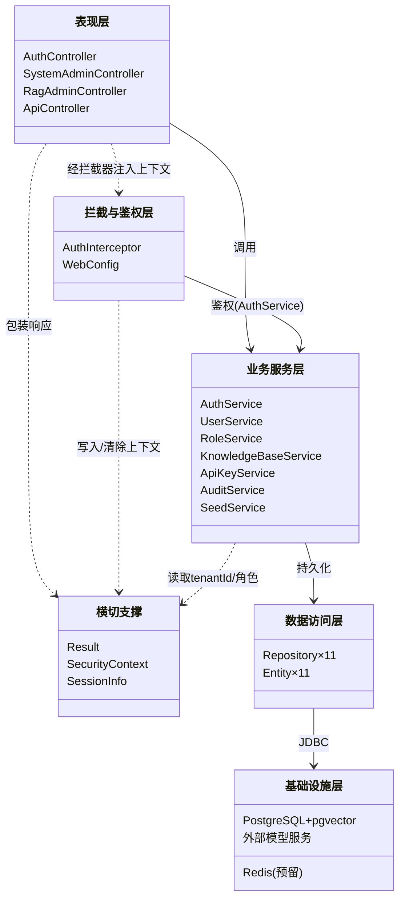

> 说明：`..>` 表示依赖（非持有），`-->` 表示调用/关联。所有跨层调用最终经 Repository 落到 PostgreSQL+pgvector；外部模型服务（LLM/Embedding）当前为骨架占位，尚未被类引用。

### 2.2 实体领域模型（11 实体 + 关联）

基于 `entity/*` 与 `03 §4` 数据字典。仅 `User↔Role` 为 JPA `@ManyToMany`（关联表 `user_roles`）；其余为**逻辑外键字段**（`tenantId` / `kbId` / `ownerId` 等），图中以虚线依赖标注跨实体引用关系，字段级约束见 03 §4.3。

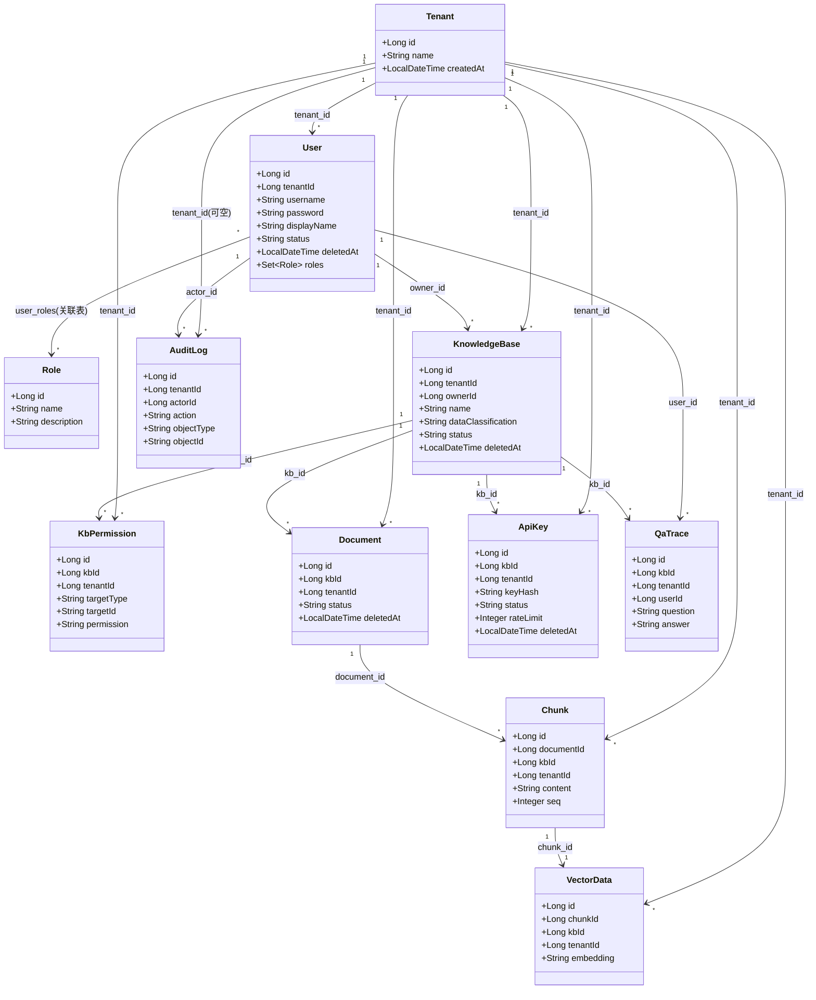

> 基数说明：`"1" --> "*"` 表示"一（父）对多（子）"；`User "*" --> "*" Role` 为多对多（经 `user_roles` 关联表）。`AuditLog`/`QaTrace` 的 `tenantId`/`actorId`/`kbId`/`userId` 允许 NULL（独立留存，不随业务对象删除而失效，见 03 §4.3.11/12）。

### 2.3 认证鉴权模块类图

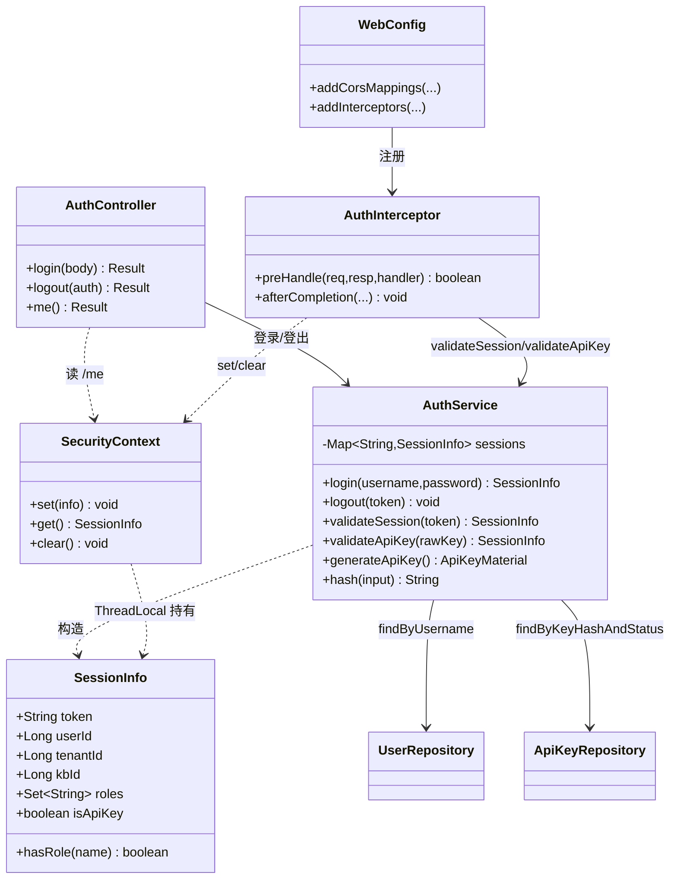

> 会话态：`AuthService.sessions` 为内存 `ConcurrentHashMap`（生产应改 Redis，见 05 §6/§8）。`validateApiKey` 经 `key_hash` SHA-256 比对定位绑定 KB 与 `tenant_id`，写入 `SessionInfo.isApiKey=true`。

### 2.4 系统管理模块类图

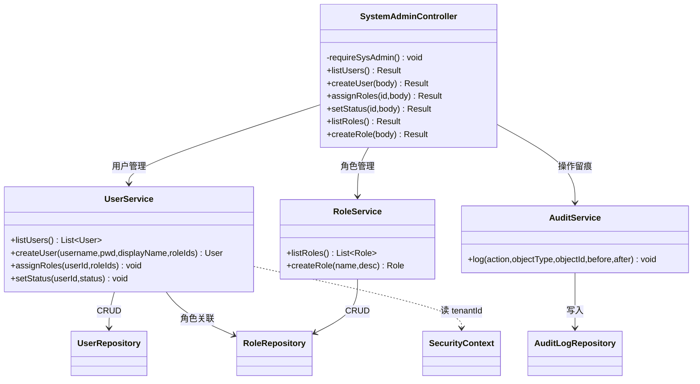

> 权限守卫：每个管理接口先调用 `requireSysAdmin()`（`SecurityContext.get().hasRole("系统管理员")`），否则抛异常；写操作后置 `auditService.log(...)`（见 2.4 时序）。

### 2.5 知识库管理模块类图

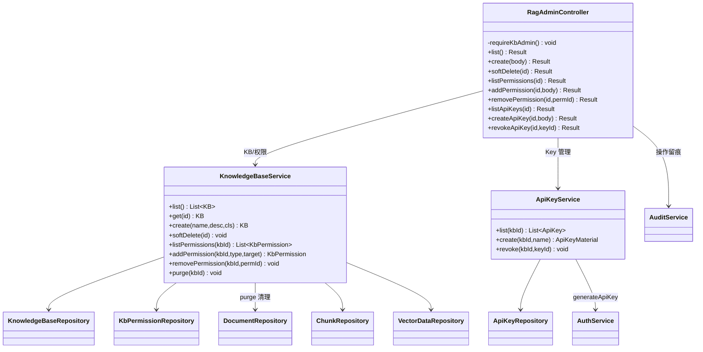

> `ApiKeyService.create` 委托 `AuthService.generateApiKey()` 生成明文（仅返回一次）+ SHA-256 哈希；`KnowledgeBaseService.purge` 物理清理 `document/chunk/vector_data`，但**不删** `audit_log`/`qa_trace`（见 03 §4.3.11/12、05 §9.4）。

### 2.6 对外 API 模块类图

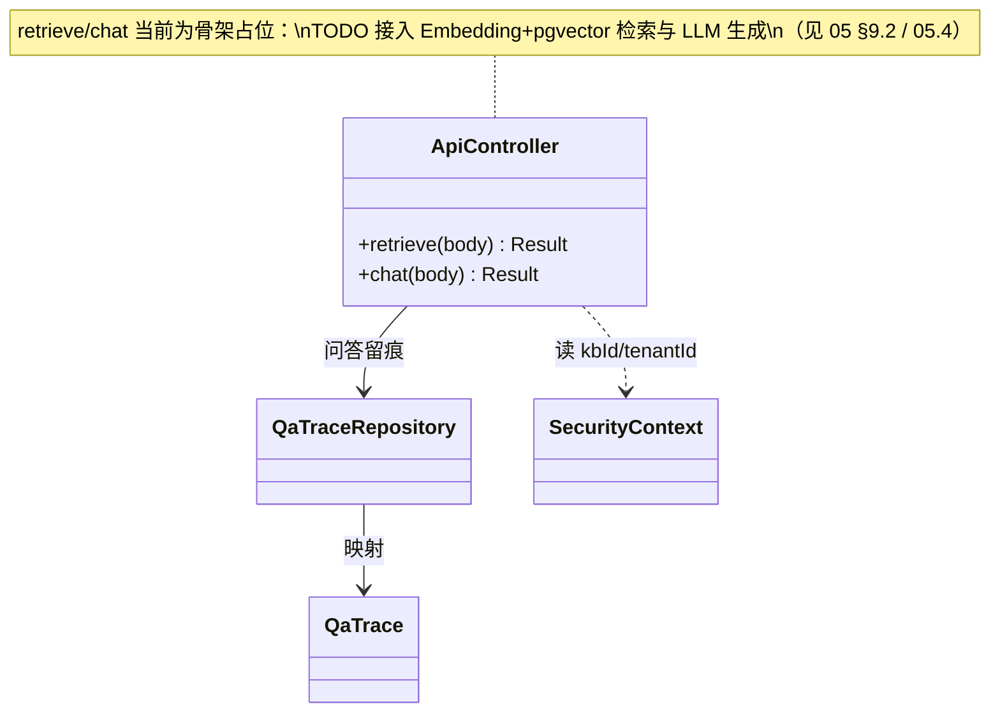

> 鉴权由 `AuthInterceptor` 在 `/api/v1/**` 前缀下用 API Key 完成（见 2.3 / 3.3）；`chat` 已落 `qa_trace`（独立留存）。

### 2.7 合规可观测模块类图

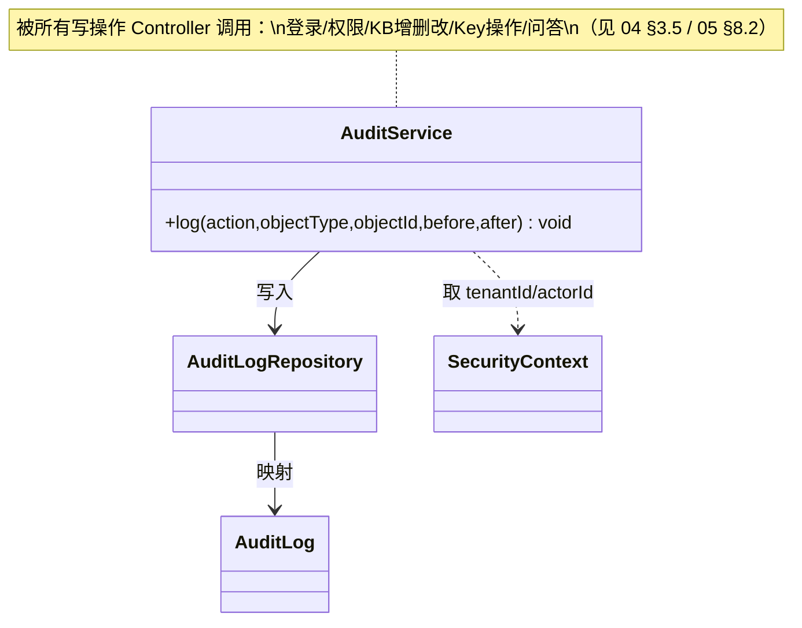

### 2.8 初始化模块类图

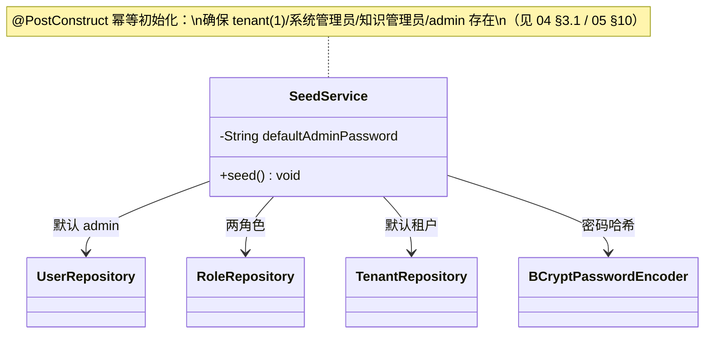

---

## 3. 关键流程时序图（Sequence Diagram）

### 3.1 登录与会话建立

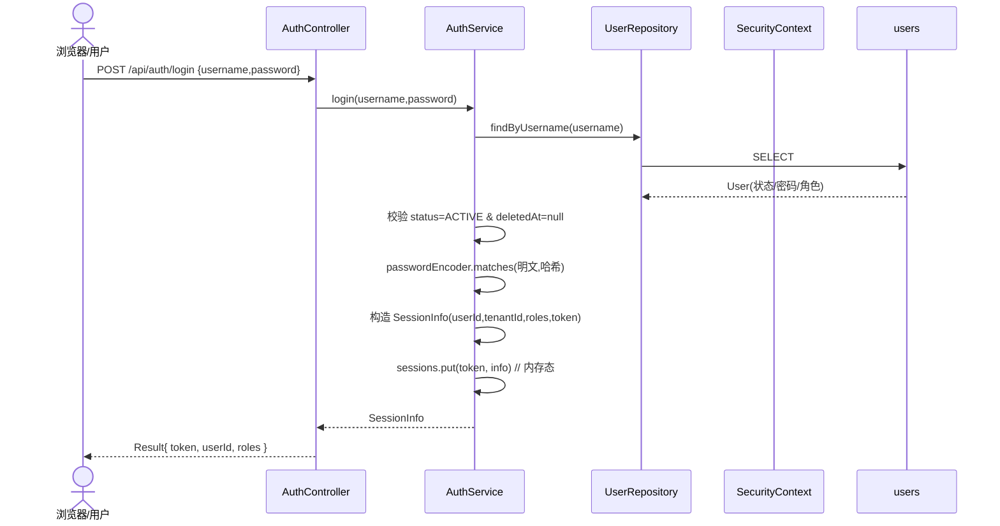

> 失败分支：用户不存在 / 已停用 / 密码错误 → 抛 `RuntimeException` → 由全局异常处理（TODO）返回错误；当前 `Result.fail` 已定义但未接 `@ControllerAdvice`。

### 3.2 会话鉴权拦截（管理接口）

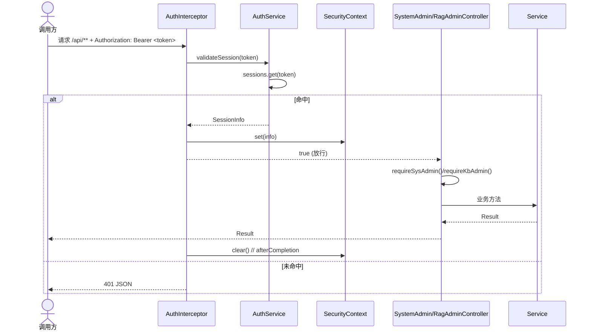

> 白名单：`WebConfig` 排除 `/api/auth/login`；其余 `/api/**` 均经 `AuthInterceptor`（见 05 §8.1）。API Key 路径见 3.3。

### 3.3 API Key 鉴权（对外接口 `/api/v1`）

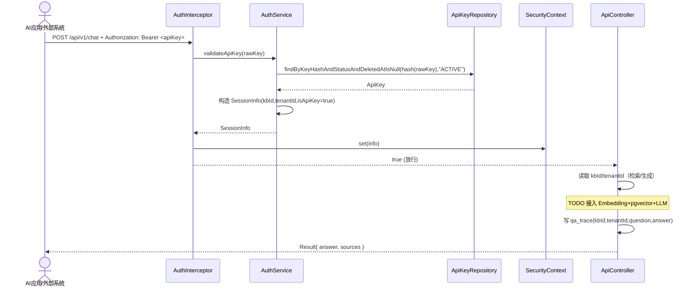

> 隔离继承：API Key 绑定的 `kb_id`/`tenant_id` 注入 `SessionInfo`，后续检索/生成自动受隔离与 RBAC 约束（见 05 §8.1 / §9.3）。

### 3.4 知识库创建 + 检索权限授权

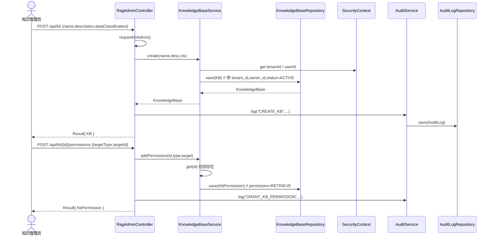

> RBAC 粒度：授权对象 `target_type=ROLE/USER/EXTERNAL`，权限仅 `RETRIEVE`（只读检索/问答，见 03 §4.3.6 / 04 §3.2）。

### 3.5 检索 / 问答（RAG 骨架占位）

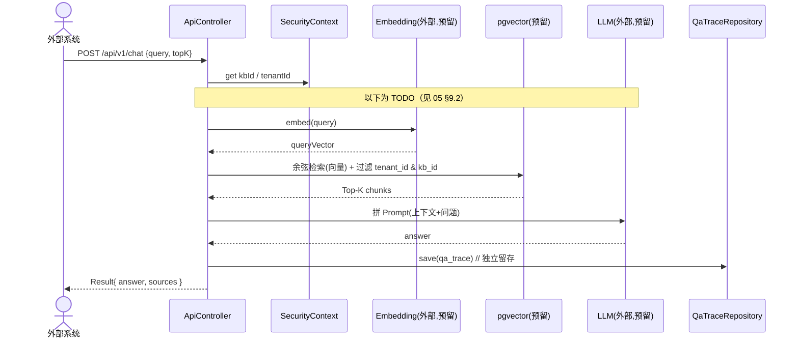

> 当前骨架：`retrieve`/`chat` 返回占位结构；仅 `chat` 已落 `qa_trace`。真实 Embedding/LLM/pgvector 检索待接入（见 05 §10 / §11）。

### 3.6 知识库软删除与物理清理（生命周期）

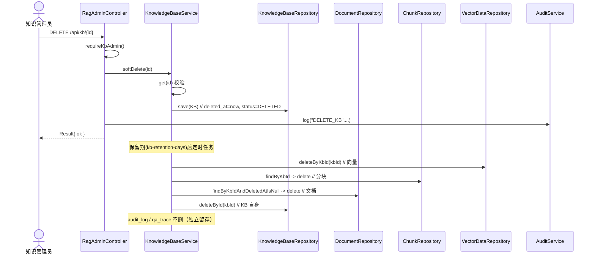

> 软删即暂停检索；过期物理清理仅清业务数据，审计/留痕独立保留（见 05 §9.4 / 03 §7）。定时清理任务当前为 TODO（见 05 §11）。

### 3.7 用户创建（系统管理）

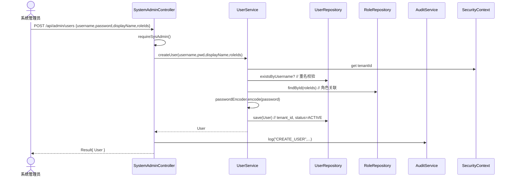

> 不开放自助注册；初始密码由系统管理员设定，首次改密与强制策略后置（见 04 §3.1）。

### 3.8 启动种子初始化

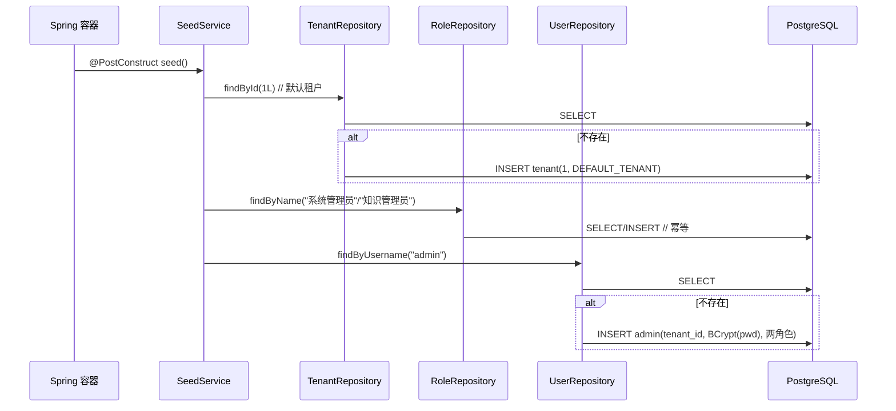

> 幂等：`ON CONFLICT DO NOTHING` 语义由 `orElseGet` 保证（见 05 §7 / §10）。

---

## 4. 与 04 / 05 的对应关系 & 待完善

### 4.1 与架构文档映射

| 04/05 要素 | 本文档落点 |
| --- | --- |
| 04 §3 应用模块职责 | §2.3~2.8 各模块类图、§3 时序 |
| 05 §2.2 分层架构 | §2.1 分层依赖图 |
| 05 §5 模块拆分 | §1.3 类清单 |
| 03 §4 实体数据字典 | §2.2 实体领域模型（字段级见 03） |
| 05 §8 安全基础设施 | §2.3 / §3.2 / §3.3 鉴权 |
| 05 §9.4 生命周期 | §3.6 软删与清理 |

### 4.2 待完善（骨架缺口，与 05 §11 对齐）

- [ ] `retrieve`/`chat` 真实接入 Embedding + pgvector 相似检索 + LLM 生成（§3.5 TODO）。
- [ ] 会话 `sessions` 内存态改 Redis；API Key 限流（按 `rate_limit`）落地。
- [ ] `VectorData.embedding` 由 `String`(JSON) 改原生 `PGvector`，建 ANN 索引（IVFFlat/HNSW）。
- [ ] 知识库软删后的定时物理清理任务（`purge` 已具备，缺调度触发）。
- [ ] 全局异常处理 `@ControllerAdvice` 统一将 `RuntimeException` 转 `Result.fail`（§3.1 提及）。
- [ ] `AuthInterceptor` 注入 `SET LOCAL app.current_tenant` 启用 RLS 兜底（见 03 §5.2）。
- [ ] 接口契约与错误码规范（见 05.4 接口设计，待补）。

---

> 备注：本文档为模块详细设计草稿，类图/时序图均依据当前 `src/main/java/com/qoobot/qoorag` 代码骨架绘制；随开发推进（尤其 RAG 链路与限流/清理任务落地）持续迭代。
