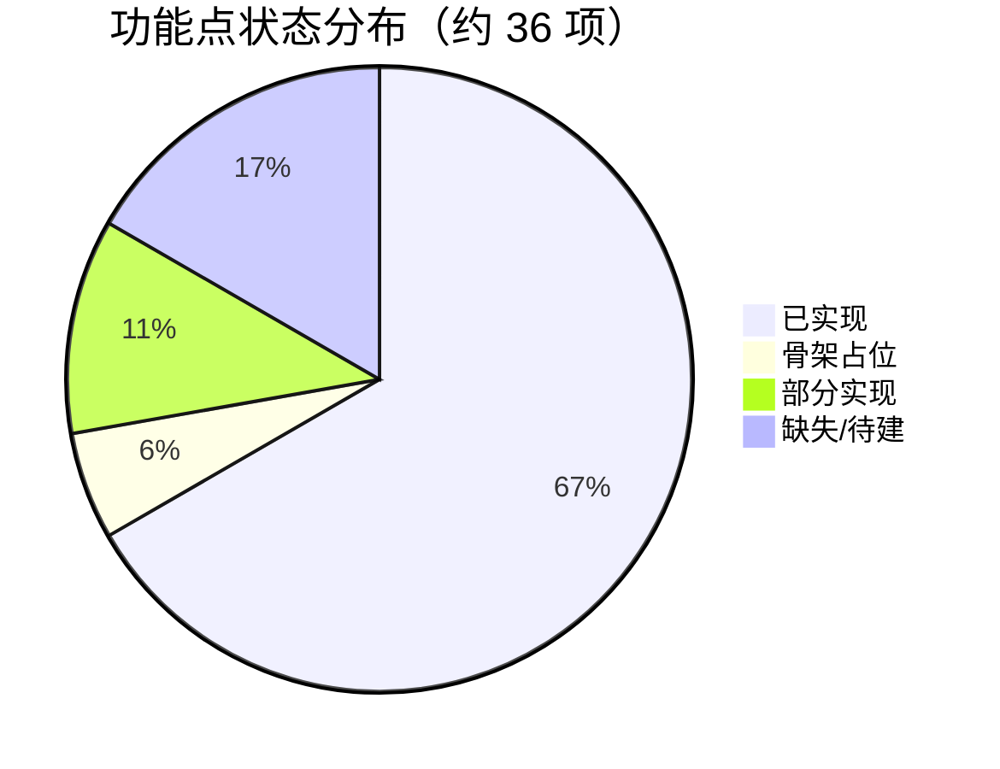
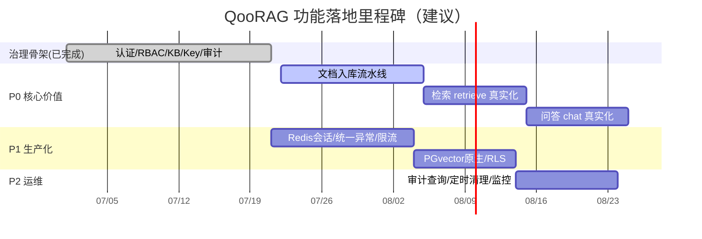

# 06 功能清单与进度跟踪

> 版本：v0.1 草稿（对应代码骨架 `main@HEAD`）
> 配套文档：04 应用架构设计、05 技术架构设计、05.3 模块详细设计、05.4 接口设计（`openapi.yaml`）
> 状态图例：✅ 已实现　⚠️ 骨架占位（接口存在，逻辑 TODO）　🔲 缺失/待建　🟡 部分实现
> 文档状态图例：📝 草稿/待评审　🔄 持续更新　✅ 已成型
> 本文档同时承担"文档进度与待定事项汇总"（见 §7），与各设计文档的待定章节保持一致。

---

## 1 进度总览

本系统当前为**治理与基础设施骨架已基本成型、RAG 核心链路仅占位**的状态。下表按能力域给出完成度估算（基于真实代码行与接口落地情况，非按文档体量）。

| 能力域 | 完成度 | 说明 |
|---|---|---|
| 认证与鉴权（4.4 / 4.10） | 🟡 ~80% | 登录/会话/API Key 校验均已实现；会话为内存态，缺 Redis 持久化与过期 |
| 系统管理 RBAC（4.4） | ✅ ~90% | 用户/角色 CRUD、审计写入已实现；审计仅写入无查询接口 |
| 知识库管理（4.2 / 4.11） | ✅ ~90% | KB CRUD、权限、软删、物理清理均已实现；缺保留期定时清理 |
| API Key 管理（4.10） | 🟡 ~70% | 签发/吊销已实现；`rateLimit` 字段未生效 |
| 对外检索/问答 API（4.10） | ⚠️ ~15% | 接口与鉴权就绪；`retrieve`/`chat` 为占位，RAG 链路待接入 |
| 文档入库流水线 | 🔲 0% | `Document/Chunk/VectorData` 仅有数据模型，无上传/解析/向量化接口 |
| 横切基础设施 | 🟡 ~50% | 统一响应、安全上下文、租户隔离已落地；缺 `@ControllerAdvice`、RLS、PGvector 原生、限流 |

**总体完成度（功能点加权）：约 60% 骨架完成度；其中核心价值链路（检索/问答/入库）约 10%。**

---

## 2 功能模块清单与状态

### 2.1 认证与鉴权模块（4.4 / 4.10）

| 功能点 | 接口/类 | 状态 | 说明 |
|---|---|---|---|
| 账号密码登录建会话 | `AuthService.login` | ✅ | BCrypt 校验 + UUID 令牌 |
| 登出 | `AuthService.logout` | ✅ | 移除内存会话 |
| 会话令牌校验 | `AuthService.validateSession` | ✅ | `ConcurrentHashMap` 查询 |
| 统一鉴权拦截 | `AuthInterceptor.preHandle` | ✅ | 双通道：管理接口走会话、`/api/v1` 走 API Key |
| API Key 校验 | `AuthService.validateApiKey` | ✅ | SHA-256 比对 `key_hash` |
| API Key 生成（明文仅一次） | `AuthService.generateApiKey` | ✅ | `qk_` 前缀明文 + 哈希存储 |
| 启动种子初始化 | `SeedService.seed` | ✅ | 默认租户 + 两角色 + `admin` 账号 |
| 会话持久化（Redis） | — | 🔲 | 当前内存态，重启即失、不可水平扩展 |
| 令牌过期/续期 | — | 🔲 | 无 TTL 机制 |

### 2.2 系统管理模块（4.4）

| 功能点 | 接口 | 状态 | 说明 |
|---|---|---|---|
| 用户列表（租户隔离） | `GET /api/admin/users` | ✅ | 按 `tenant_id` 过滤未删除用户 |
| 创建用户 | `POST /api/admin/users` | ✅ | BCrypt 加密存储 |
| 分配角色 | `POST /api/admin/users/{id}/roles` | ✅ | |
| 启用/停用 | `PUT /api/admin/users/{id}/status` | ✅ | |
| 角色列表 | `GET /api/admin/roles` | ✅ | |
| 创建角色 | `POST /api/admin/roles` | ✅ | |
| 审计日志写入 | `AuditService.log` | ✅ | 各写操作均留痕 |
| 审计日志查询/导出 | — | 🔲 | 仅写入，无查询/分页/导出接口 |

### 2.3 知识库管理模块（4.2 / 4.10 / 4.11）

| 功能点 | 接口 | 状态 | 说明 |
|---|---|---|---|
| KB 列表（租户隔离） | `GET /api/kb` | ✅ | |
| KB 创建 | `POST /api/kb` | ✅ | 写审计 |
| KB 软删除 | `DELETE /api/kb/{id}` | ✅ | 标记 `deleted_at` |
| KB 权限列表 | `GET /api/kb/{id}/permissions` | ✅ | |
| KB 权限授予 | `POST /api/kb/{id}/permissions` | ✅ | 默认 `RETRIEVE` |
| KB 权限回收 | `DELETE /api/kb/{id}/permissions/{permId}` | ✅ | |
| KB 物理清理 | `DELETE` 逻辑（`purge`） | ✅ | 删文档/分块/向量；审计与问答留痕保留 |
| 保留期定时清理 | — | 🔲 | `purge` 仅手动，无 `@Scheduled` 保留期清理 |

### 2.4 API Key 管理模块（4.10）

| 功能点 | 接口 | 状态 | 说明 |
|---|---|---|---|
| Key 列表 | `GET /api/kb/{id}/apikeys` | ✅ | |
| Key 创建（明文一次） | `POST /api/kb/{id}/apikeys` | ✅ | 返回 `rawKey` 仅一次 |
| Key 吊销 | `DELETE /api/kb/{id}/apikeys/{keyId}` | ✅ | 软删 + `REVOKED` |
| 速率限制生效 | — | 🔲 | `rateLimit` 字段已存但未校验 |

### 2.5 对外检索 / 问答 API（4.10）

| 功能点 | 接口 | 状态 | 说明 |
|---|---|---|---|
| 检索 `retrieve` | `POST /api/v1/retrieve` | ⚠️ | 占位：返回空 `chunks`；TODO embedding + pgvector 相似检索 |
| 问答 `chat` | `POST /api/v1/chat` | ⚠️ | 占位：返回骨架文案；TODO 检索→拼 Prompt→调 LLM |
| 问答留痕 | `QaTraceRepository` | ✅ | `chat` 已落 `QaTrace`（独立于业务数据） |

### 2.6 文档入库流水线（缺失）

| 功能点 | 接口 | 状态 | 说明 |
|---|---|---|---|
| 文档上传 | — | 🔲 | 无 `MultipartFile` 接口 |
| 文档解析 | — | 🔲 | 无解析器 |
| 文本分块 | — | 🔲 | `Chunk` 实体存在，无切分逻辑 |
| 向量化 embedding | — | 🔲 | `VectorData` 实体存在，无 embedding 调用 |
| 数据模型（实体+Repository） | `Document/Chunk/VectorData` | ✅ | 11 实体 + 11 Repository 已就位 |

### 2.7 横切基础设施

| 功能点 | 类/机制 | 状态 | 说明 |
|---|---|---|---|
| 统一响应包装 | `Result` | ✅ | `{code,message,data}` |
| 安全上下文 | `SecurityContext`（ThreadLocal） | ✅ | 请求内透传租户/用户/KB |
| 租户隔离（代码层） | 各 Service | 🟡 | 逻辑外键 `tenant_id` 过滤；无数据库 RLS |
| 统一异常处理 | — | 🔲 | 业务异常直接抛 `RuntimeException`；拦截器手写 JSON，缺 `@ControllerAdvice` |
| PGvector 原生向量 | `VectorConverter` | 🟡 | 当前以 `float[]`/字符串存储，未用 `vector` 类型与 `<=>` 算子 |
| 限流 | — | 🔲 | 无组件；`rateLimit` 未生效 |

---

## 3 接口实现对照（对齐 openapi.yaml 20 接口）

| # | 接口 | 路径 | 状态 |
|---|---|---|---|
| 1 | 登录 | `POST /api/auth/login` | ✅ |
| 2 | 登出 | `POST /api/auth/logout` | ✅ |
| 3 | 当前会话 | `GET /api/auth/me` | ✅ |
| 4 | 用户列表 | `GET /api/admin/users` | ✅ |
| 5 | 创建用户 | `POST /api/admin/users` | ✅ |
| 6 | 分配角色 | `POST /api/admin/users/{id}/roles` | ✅ |
| 7 | 启停用户 | `PUT /api/admin/users/{id}/status` | ✅ |
| 8 | 角色列表 | `GET /api/admin/roles` | ✅ |
| 9 | 创建角色 | `POST /api/admin/roles` | ✅ |
| 10 | KB 列表 | `GET /api/kb` | ✅ |
| 11 | KB 创建 | `POST /api/kb` | ✅ |
| 12 | KB 软删 | `DELETE /api/kb/{id}` | ✅ |
| 13 | KB 权限列表 | `GET /api/kb/{id}/permissions` | ✅ |
| 14 | KB 授权 | `POST /api/kb/{id}/permissions` | ✅ |
| 15 | KB 撤权 | `DELETE /api/kb/{id}/permissions/{permId}` | ✅ |
| 16 | Key 列表 | `GET /api/kb/{id}/apikeys` | ✅ |
| 17 | Key 创建 | `POST /api/kb/{id}/apikeys` | ✅ |
| 18 | Key 吊销 | `DELETE /api/kb/{id}/apikeys/{keyId}` | ✅ |
| 19 | 检索 | `POST /api/v1/retrieve` | ⚠️ 骨架 |
| 20 | 问答 | `POST /api/v1/chat` | ⚠️ 骨架 |

> 18/20 接口已落地（含鉴权与审计），2/20 为占位骨架。

---

## 4 缺口与待办（按优先级）

### P0 — 核心价值链路（决定产品可用性）
1. **文档入库流水线**：上传 → 解析 → 分块 → embedding → 写 `VectorData`（新建 `IngestController`/`IngestService`）。
2. **检索 `retrieve` 真实化**：embedding 查询 + pgvector 相似度（受 `kb_id`/`tenant_id` 约束）+ 权限校验。
3. **问答 `chat` 真实化**：检索 → 拼 Prompt → 调 LLM → 流式返回 + `sources` + `usage`。

### P1 — 生产化加固
4. 会话改 Redis（`Spring Session`/RedisTemplate），加 TTL 与续期。
5. `@ControllerAdvice` 统一异常处理，映射 05.4 错误码（40001/40101…/50001）。
6. 速率限制生效（基于 `ApiKey.rateLimit`，如令牌桶/Redis 计数）。
7. PGvector 原生 `vector` 类型 + `<=>` 算子，替换 `VectorConverter` 字符串方案。
8. 数据库 RLS（行级安全）注入 `tenant_id`，与代码层隔离双保险。

### P2 — 运维与可观测
9. 审计日志查询/分页/导出接口。
10. KB 保留期 `@Scheduled` 定时 `purge`。
11. 监控指标（QPS/延迟/检索命中率）、健康检查、日志规范。

---

## 5 里程碑计划建议

---

## 6 与 04 / 05 文档映射

| 本文档章节 | 对应设计文档 | 对应关系 |
|---|---|---|
| §2.1 认证鉴权 | 04 §4.4、05 §5 安全 | 实现对照设计 |
| §2.2 系统管理 | 04 §4.4 RBAC | 实现对照设计 |
| §2.3 知识库管理 | 04 §4.2、§4.11 | 实现对照设计 |
| §2.4 / §2.5 API Key 与对外 API | 04 §4.10、05.4 | 实现对照接口契约 |
| §2.6 入库流水线 | 03 §4 数据模型、05 §5 RAG | 设计就绪，实现缺失 |
| §4 P1 生产化 | 05 §5 安全/高可用 | 设计就绪，实现缺口 |

> 备注：本文档为功能进度草稿，随开发提交持续更新（建议每次 `git commit` 后同步修订 §2/§3 状态）。

---

## 7. 文档进度与待定事项汇总

> 说明：§1–§6 为**功能/代码进度**；本章为**文档层面的待定事项收敛**——汇总 00~05.4 各文档自身的"草稿/待评审/待补"清单，便于统一跟踪文档成熟度与待办。§7.3 与 §4 互为补充（§4 偏实现缺口，§7.3 偏文档待定）。

### 7.1 文档成熟度一览

| 文档 | 版本 | 状态 | 成熟度 | 主要待定（详见 §7.2） |
| --- | --- | --- | --- | --- |
| 00 头脑风暴 | v0.1 草稿 | 脑暴中 / 待收敛 | 概念级 | 9 项架构决策（02 称已收敛，待与 01 对齐确认） |
| 01 竞品调研 | v0.1 草稿 | 参照分析 | 输入级 | 9 项待定决策待拍板（见 §7.2） |
| 02 业务架构 | v0.1 草稿 | 设计中 / 待评审 | 已成型 | §9 业务待定 8 项 |
| 03 数据架构 | v0.1 草稿 | 设计中 / 待评审 | 已成型 | §8 数据待定 5 项（含 1 项已完成） |
| 04 应用架构 | v0.1 草稿 | 设计中 / 待评审 | 已成型 | §6 应用待定 7 项 |
| 05 技术架构 | v0.1 草稿 | 设计中 / 待评审 | 已成型 | §11 待办 9 项（含 3 项已完成） |
| 05.3 模块详细设计 | v0.1 草稿 | 设计中 / 待评审 | 已成型 | §4.2 待完善 7 项 |
| 05.4 接口设计 | v0.1 草稿 | 设计中 / 待评审 | 已成型 | §7.2 待完善 6 项 |
| 06 功能清单进度 | v0.1 草稿 | 持续更新中 | 跟踪级 | 随开发提交同步 §2/§3 |

> 全部 9 份文档均为 v0.1 草稿、待评审；设计主体（02~05.4）已成型，待评审与骨架补全后转 v1.0。

### 7.2 各文档待定事项明细

**00 头脑风暴**（状态：待收敛）
- 9 项架构决策已在 02 第 10 章收敛（02 自述"已全部收敛"）；与 01 开头"待逐条拍板"表述需对齐确认。

**01 竞品调研**（§3 对 9 项待定决策的启示）

| # | 待定决策项 |
| --- | --- |
| 1 | MVP 范围 vs 已定架构 |
| 2 | 用户开通方式（管理员创建 / SSO 同步，无公网注册） |
| 3 | 知识库共享（默认私有 + RBAC 只读/协作共享） |
| 4 | 外部资源 vs 数据不出域（默认内网，公网外部模型需提示+审批） |
| 5 | 默认额度数值（如积分 100 万、容量 10GB，初版拍定） |
| 6 | 积分折算规则（1k token=N 分、1 次 embedding=M 分，初版默认值） |
| 7 | 多租户隔离实现（tenant_id 行级隔离 + PostgreSQL RLS） |
| 8 | API 鉴权与限流（OpenAI 兼容 + 按 KB 签 Key + 与配额挂钩限流） |
| 9 | 知识库生命周期（删库清向量、审计独立留存 ≥6 个月） |

**02 业务架构**（§9 业务层面待定，8 项）
- [ ] 资源池界面化管理（MVP 先用配置/初始化）
- [ ] 企业身份对接（SSO/OAuth2/LDAP/IM）正式接入与账号映射
- [ ] 配额/计费拦截（产品化/云化阶段）
- [ ] 多数据源连接器、复杂权限体系、评估平台
- [ ] 脱敏、密评、内容安全细化、留存策略固化
- [ ] 检索质量评估与调试工具（召回率/命中率）
- [ ] 混合检索（向量+BM25）与 Rerank 是否纳入 MVP 的边界确认
- [ ] 等保专项测评/整改材料（立项后由安全合规部门核定级别）

**03 数据架构**（§8 数据层面待定，5 项）
- [ ] 确认首批 Embedding 模型维度（当前固定 `vector(1536)`，接 768 维需动态维度）
- [ ] 启用 RLS 兜底（注入 `SET LOCAL app.current_tenant`）
- [x] 数据字典逐字段（已内联于 §4.3）✅ 已完成
- [ ] 数据分级枚举对齐企业现有标准
- [ ] 等保留存策略固化（≥6 个月）、脱敏/密评

**04 应用架构**（§6 应用层面待定，7 项）
- [ ] 资源池界面化管理（MVP 先用配置/初始化）
- [ ] 企业身份对接（SSO/OAuth2/LDAP/IM）正式接入与账号映射
- [ ] 多数据源连接器（Notion/Confluence/DB/URL 抓取等）
- [ ] 复杂权限/角色体系、细粒度菜单权限
- [ ] 检索质量评估与调试工具（召回率/命中率）
- [ ] 混合检索（向量+BM25）与 Rerank 是否纳入 MVP 的边界确认
- [ ] 接口契约完善（05.4）：OpenAPI、错误码规范

**05 技术架构**（§11 后续演进与待办，9 项）
- [ ] 接入 pgvector JDBC，向量类型改原生 `PGvector`，建 ANN 索引
- [ ] 在 AuthInterceptor 注入 `SET LOCAL app.current_tenant`，启用 RLS 兜底
- [ ] 实现文档异步处理流水线（解析/分块/Embedding）与状态机
- [ ] 实现按 Key 限流（Redis 或内存计数）
- [ ] 全链路审计埋点（登录/权限/KB 增删改/Key 操作/问答）
- [ ] 知识库删除定时清理任务（保留期物理清理）
- [ ] 资源池界面化管理（LLM/Embedding/向量库配置）
- [ ] K8s/Helm 部署、TLS、监控（Prometheus）
- [ ] 等保专项：脱敏、密评、内容安全、留存固化
- [x] 05.3 模块详细设计 ✅ 已完成
- [x] 05.4 接口设计 ✅ 已完成
- [x] 06 功能清单进度文档 ✅ 已完成

**05.3 模块详细设计**（§4.2 待完善，7 项）
- [ ] `retrieve`/`chat` 真实接入 Embedding + pgvector 相似检索 + LLM 生成
- [ ] 会话 `sessions` 内存态改 Redis；API Key 限流（按 `rate_limit`）落地
- [ ] `VectorData.embedding` 由 `String`(JSON) 改原生 `PGvector`，建 ANN 索引
- [ ] 知识库软删后的定时物理清理任务（`purge` 已具备，缺调度触发）
- [ ] 全局异常处理 `@ControllerAdvice` 统一将 `RuntimeException` 转 `Result.fail`
- [ ] `AuthInterceptor` 注入 `SET LOCAL app.current_tenant` 启用 RLS 兜底
- [ ] 接口契约与错误码规范（见 05.4，待补）

**05.4 接口设计**（§7.2 待完善，6 项）
- [ ] 接入 `@Validated` + `@ControllerAdvice`，将 `RuntimeException` 统一转为 `Result.fail`
- [ ] 实现按 Key `rate_limit` 限流（返回 `42901`）
- [ ] `/api/v1/retrieve`、`/api/v1/chat` 真实接入 Embedding + pgvector + LLM（移除 `x-status: skeleton`）
- [ ] 文档上传/解析/分块/向量化流水线接口
- [ ] 分页/排序参数标准化
- [ ] 错误码细化：租户隔离越权（403 细分）、资源池配置接口

### 7.3 跨文档统一待定事项总表（去重合并）

> 将 §7.2 各文档待定项去重合并，标注来源文档、优先级（对齐 §4 P0/P1/P2）与状态。

| # | 统一待定事项 | 来源文档 | 优先级 | 状态 |
| --- | --- | --- | --- | --- |
| 1 | RAG 核心链路真实化（retrieve/chat 接入 Embedding+pgvector+LLM） | 05§11、05.3§4.2、05.4§7.2、06§4 | P0 | ⚠️ 骨架 |
| 2 | 文档入库流水线（上传/解析/分块/向量化 + 状态机） | 05§11、05.4§7.2、06§4 | P0 | 🔲 缺失 |
| 3 | pgvector 原生类型 + ANN 索引（替换 String JSON） | 05§11、05.3§4.2 | P1 | 🔲 缺失 |
| 4 | Redis 会话（替换内存 ConcurrentHashMap） | 05.3§4.2、06§4 | P1 | 🔲 缺失 |
| 5 | API Key 限流（rate_limit 生效，42901） | 05§11、05.3§4.2、05.4§7.2、06§4 | P1 | 🔲 缺失 |
| 6 | `@ControllerAdvice` + `@Validated` 统一异常/校验 | 05.3§4.2、05.4§7.2 | P1 | 🔲 缺失 |
| 7 | RLS 兜底（SET LOCAL app.current_tenant） | 05§11、05.3§4.2、03§8 | P1 | 🔲 缺失 |
| 8 | 知识库定时物理清理（保留期调度） | 05§11、05.3§4.2 | P1 | 🔲 缺失 |
| 9 | 全链路审计埋点（登录/权限/KB/Key/问答） | 05§11 | P1 | 🟡 部分（写入已就绪，缺埋点广度） |
| 10 | Embedding 模型维度确认（动态维度） | 03§8 | P1 | 🔲 待确认 |
| 11 | 接口契约/错误码细化（租户越权细分、分页标准化） | 05.4§7.2、04§6 | P1 | 🟡 部分 |
| 12 | 资源池界面化管理（LLM/Embedding/向量库配置） | 02§9、04§6、05§11 | P2 | 🔲 缺失 |
| 13 | 企业身份对接（SSO/OAuth2/LDAP/IM） | 02§9、04§6 | P2 | 🔲 缺失 |
| 14 | 多数据源连接器（Notion/Confluence/DB/URL） | 02§9、04§6 | P2 | 🔲 缺失 |
| 15 | 配额/计费拦截（含额度数值、积分折算） | 02§9、01 决策 5/6 | P2 | 🔲 缺失 |
| 16 | 混合检索（向量+BM25）+ Rerank MVP 边界确认 | 02§9、04§6 | P2 | 🔲 待确认 |
| 17 | 检索质量评估与调试工具（召回率/命中率） | 02§9、04§6 | P2 | 🔲 缺失 |
| 18 | 数据分级枚举对齐企业标准 | 03§8 | P2 | 🔲 缺失 |
| 19 | 等保留存策略固化（≥6月）、脱敏、密评、内容安全 | 02§9、03§8、05§11 | P1/P2 | 🔲 缺失 |
| 20 | 等保专项测评/整改材料 | 02§9、05§11 | P2 | 🔲 缺失（立项后） |
| 21 | K8s/Helm 部署、TLS、监控（Prometheus） | 05§11 | P2 | 🔲 缺失 |
| 22 | 9 项业务待定决策拍板（01 §3）并与 02 收敛结论对齐 | 01、02 | 决策 | 🟡 02 称已收敛，待对齐 |

> 统一待定共 22 项：P0 2 项（决定产品可用性）、P1 10 项（生产化加固）、P2 9 项（产品化/合规/运维）、决策级 1 项。与 §4 代码缺口一致；本文档作为全量待定事项的唯一跟踪入口。

---

> 备注：本文档为功能与文档双进度草稿；功能进度见 §1–§6，文档进度与待定事项汇总见 §7，随开发提交与文档评审持续更新。
