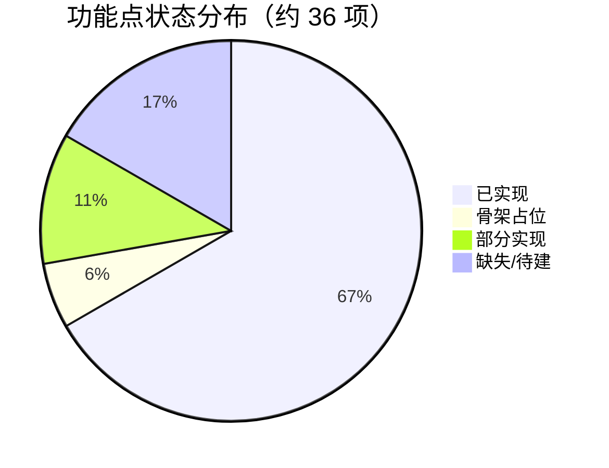
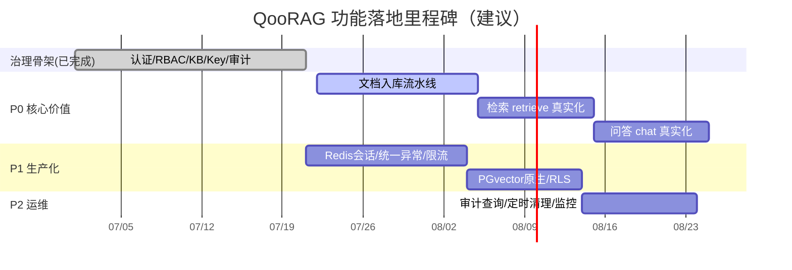

# 06 功能清单与进度跟踪

> 版本：v0.1 草稿（对应代码骨架 `main@HEAD`）
> 配套文档：04 应用架构设计、05 技术架构设计、05.3 模块详细设计、05.4 接口设计（`openapi.yaml`）
> 状态图例：✅ 已实现　⚠️ 骨架占位（接口存在，逻辑 TODO）　🔲 缺失/待建　🟡 部分实现

---

## 1 进度总览

本系统当前为**治理与基础设施骨架已基本成型、RAG 核心链路仅占位**的状态。下表按能力域给出完成度估算（基于真实代码行与接口落地情况，非按文档体量）。

| 能力域 | 完成度 | 说明 |
|---|---|---|
| 认证与鉴权（4.4 / 4.10） | 🟡 ~80% | 登录/会话/API Key 校验均已实现；会话为内存态，缺 Redis 持久化与过期 |
| 系统管理 RBAC（4.4） | ✅ ~90% | 用户/角色 CRUD、审计写入已实现；审计仅写入无查询接口 |
| 知识库管理（4.2 / 4.11） | ✅ ~90% | KB CRUD、权限、软删、物理清理均已实现；缺保留期定时清理 |
| API Key 管理（4.10） | 🟡 ~70% | 签发/吊销已实现；`rateLimit` 字段未生效 |
| 对外检索/问答 API（4.10） | ⚠️ ~15% | 接口与鉴权就绪；`retrieve`/`chat` 为占位，RAG 链路待接入 |
| 文档入库流水线 | 🔲 0% | `Document/Chunk/VectorData` 仅有数据模型，无上传/解析/向量化接口 |
| 横切基础设施 | 🟡 ~50% | 统一响应、安全上下文、租户隔离已落地；缺 `@ControllerAdvice`、RLS、PGvector 原生、限流 |

**总体完成度（功能点加权）：约 60% 骨架完成度；其中核心价值链路（检索/问答/入库）约 10%。**

---

## 2 功能模块清单与状态

### 2.1 认证与鉴权模块（4.4 / 4.10）

| 功能点 | 接口/类 | 状态 | 说明 |
|---|---|---|---|
| 账号密码登录建会话 | `AuthService.login` | ✅ | BCrypt 校验 + UUID 令牌 |
| 登出 | `AuthService.logout` | ✅ | 移除内存会话 |
| 会话令牌校验 | `AuthService.validateSession` | ✅ | `ConcurrentHashMap` 查询 |
| 统一鉴权拦截 | `AuthInterceptor.preHandle` | ✅ | 双通道：管理接口走会话、`/api/v1` 走 API Key |
| API Key 校验 | `AuthService.validateApiKey` | ✅ | SHA-256 比对 `key_hash` |
| API Key 生成（明文仅一次） | `AuthService.generateApiKey` | ✅ | `qk_` 前缀明文 + 哈希存储 |
| 启动种子初始化 | `SeedService.seed` | ✅ | 默认租户 + 两角色 + `admin` 账号 |
| 会话持久化（Redis） | — | 🔲 | 当前内存态，重启即失、不可水平扩展 |
| 令牌过期/续期 | — | 🔲 | 无 TTL 机制 |

### 2.2 系统管理模块（4.4）

| 功能点 | 接口 | 状态 | 说明 |
|---|---|---|---|
| 用户列表（租户隔离） | `GET /api/admin/users` | ✅ | 按 `tenant_id` 过滤未删除用户 |
| 创建用户 | `POST /api/admin/users` | ✅ | BCrypt 加密存储 |
| 分配角色 | `POST /api/admin/users/{id}/roles` | ✅ | |
| 启用/停用 | `PUT /api/admin/users/{id}/status` | ✅ | |
| 角色列表 | `GET /api/admin/roles` | ✅ | |
| 创建角色 | `POST /api/admin/roles` | ✅ | |
| 审计日志写入 | `AuditService.log` | ✅ | 各写操作均留痕 |
| 审计日志查询/导出 | — | 🔲 | 仅写入，无查询/分页/导出接口 |

### 2.3 知识库管理模块（4.2 / 4.10 / 4.11）

| 功能点 | 接口 | 状态 | 说明 |
|---|---|---|---|
| KB 列表（租户隔离） | `GET /api/kb` | ✅ | |
| KB 创建 | `POST /api/kb` | ✅ | 写审计 |
| KB 软删除 | `DELETE /api/kb/{id}` | ✅ | 标记 `deleted_at` |
| KB 权限列表 | `GET /api/kb/{id}/permissions` | ✅ | |
| KB 权限授予 | `POST /api/kb/{id}/permissions` | ✅ | 默认 `RETRIEVE` |
| KB 权限回收 | `DELETE /api/kb/{id}/permissions/{permId}` | ✅ | |
| KB 物理清理 | `DELETE` 逻辑（`purge`） | ✅ | 删文档/分块/向量；审计与问答留痕保留 |
| 保留期定时清理 | — | 🔲 | `purge` 仅手动，无 `@Scheduled` 保留期清理 |

### 2.4 API Key 管理模块（4.10）

| 功能点 | 接口 | 状态 | 说明 |
|---|---|---|---|
| Key 列表 | `GET /api/kb/{id}/apikeys` | ✅ | |
| Key 创建（明文一次） | `POST /api/kb/{id}/apikeys` | ✅ | 返回 `rawKey` 仅一次 |
| Key 吊销 | `DELETE /api/kb/{id}/apikeys/{keyId}` | ✅ | 软删 + `REVOKED` |
| 速率限制生效 | — | 🔲 | `rateLimit` 字段已存但未校验 |

### 2.5 对外检索 / 问答 API（4.10）

| 功能点 | 接口 | 状态 | 说明 |
|---|---|---|---|
| 检索 `retrieve` | `POST /api/v1/retrieve` | ⚠️ | 占位：返回空 `chunks`；TODO embedding + pgvector 相似检索 |
| 问答 `chat` | `POST /api/v1/chat` | ⚠️ | 占位：返回骨架文案；TODO 检索→拼 Prompt→调 LLM |
| 问答留痕 | `QaTraceRepository` | ✅ | `chat` 已落 `QaTrace`（独立于业务数据） |

### 2.6 文档入库流水线（缺失）

| 功能点 | 接口 | 状态 | 说明 |
|---|---|---|---|
| 文档上传 | — | 🔲 | 无 `MultipartFile` 接口 |
| 文档解析 | — | 🔲 | 无解析器 |
| 文本分块 | — | 🔲 | `Chunk` 实体存在，无切分逻辑 |
| 向量化 embedding | — | 🔲 | `VectorData` 实体存在，无 embedding 调用 |
| 数据模型（实体+Repository） | `Document/Chunk/VectorData` | ✅ | 11 实体 + 11 Repository 已就位 |

### 2.7 横切基础设施

| 功能点 | 类/机制 | 状态 | 说明 |
|---|---|---|---|
| 统一响应包装 | `Result` | ✅ | `{code,message,data}` |
| 安全上下文 | `SecurityContext`（ThreadLocal） | ✅ | 请求内透传租户/用户/KB |
| 租户隔离（代码层） | 各 Service | 🟡 | 逻辑外键 `tenant_id` 过滤；无数据库 RLS |
| 统一异常处理 | — | 🔲 | 业务异常直接抛 `RuntimeException`；拦截器手写 JSON，缺 `@ControllerAdvice` |
| PGvector 原生向量 | `VectorConverter` | 🟡 | 当前以 `float[]`/字符串存储，未用 `vector` 类型与 `<=>` 算子 |
| 限流 | — | 🔲 | 无组件；`rateLimit` 未生效 |

---

## 3 接口实现对照（对齐 openapi.yaml 20 接口）

| # | 接口 | 路径 | 状态 |
|---|---|---|---|
| 1 | 登录 | `POST /api/auth/login` | ✅ |
| 2 | 登出 | `POST /api/auth/logout` | ✅ |
| 3 | 当前会话 | `GET /api/auth/me` | ✅ |
| 4 | 用户列表 | `GET /api/admin/users` | ✅ |
| 5 | 创建用户 | `POST /api/admin/users` | ✅ |
| 6 | 分配角色 | `POST /api/admin/users/{id}/roles` | ✅ |
| 7 | 启停用户 | `PUT /api/admin/users/{id}/status` | ✅ |
| 8 | 角色列表 | `GET /api/admin/roles` | ✅ |
| 9 | 创建角色 | `POST /api/admin/roles` | ✅ |
| 10 | KB 列表 | `GET /api/kb` | ✅ |
| 11 | KB 创建 | `POST /api/kb` | ✅ |
| 12 | KB 软删 | `DELETE /api/kb/{id}` | ✅ |
| 13 | KB 权限列表 | `GET /api/kb/{id}/permissions` | ✅ |
| 14 | KB 授权 | `POST /api/kb/{id}/permissions` | ✅ |
| 15 | KB 撤权 | `DELETE /api/kb/{id}/permissions/{permId}` | ✅ |
| 16 | Key 列表 | `GET /api/kb/{id}/apikeys` | ✅ |
| 17 | Key 创建 | `POST /api/kb/{id}/apikeys` | ✅ |
| 18 | Key 吊销 | `DELETE /api/kb/{id}/apikeys/{keyId}` | ✅ |
| 19 | 检索 | `POST /api/v1/retrieve` | ⚠️ 骨架 |
| 20 | 问答 | `POST /api/v1/chat` | ⚠️ 骨架 |

> 18/20 接口已落地（含鉴权与审计），2/20 为占位骨架。

---

## 4 缺口与待办（按优先级）

### P0 — 核心价值链路（决定产品可用性）
1. **文档入库流水线**：上传 → 解析 → 分块 → embedding → 写 `VectorData`（新建 `IngestController`/`IngestService`）。
2. **检索 `retrieve` 真实化**：embedding 查询 + pgvector 相似度（受 `kb_id`/`tenant_id` 约束）+ 权限校验。
3. **问答 `chat` 真实化**：检索 → 拼 Prompt → 调 LLM → 流式返回 + `sources` + `usage`。

### P1 — 生产化加固
4. 会话改 Redis（`Spring Session`/RedisTemplate），加 TTL 与续期。
5. `@ControllerAdvice` 统一异常处理，映射 05.4 错误码（40001/40101…/50001）。
6. 速率限制生效（基于 `ApiKey.rateLimit`，如令牌桶/Redis 计数）。
7. PGvector 原生 `vector` 类型 + `<=>` 算子，替换 `VectorConverter` 字符串方案。
8. 数据库 RLS（行级安全）注入 `tenant_id`，与代码层隔离双保险。

### P2 — 运维与可观测
9. 审计日志查询/分页/导出接口。
10. KB 保留期 `@Scheduled` 定时 `purge`。
11. 监控指标（QPS/延迟/检索命中率）、健康检查、日志规范。

---

## 5 里程碑计划建议

---

## 6 与 04 / 05 文档映射

| 本文档章节 | 对应设计文档 | 对应关系 |
|---|---|---|
| §2.1 认证鉴权 | 04 §4.4、05 §5 安全 | 实现对照设计 |
| §2.2 系统管理 | 04 §4.4 RBAC | 实现对照设计 |
| §2.3 知识库管理 | 04 §4.2、§4.11 | 实现对照设计 |
| §2.4 / §2.5 API Key 与对外 API | 04 §4.10、05.4 | 实现对照接口契约 |
| §2.6 入库流水线 | 03 §4 数据模型、05 §5 RAG | 设计就绪，实现缺失 |
| §4 P1 生产化 | 05 §5 安全/高可用 | 设计就绪，实现缺口 |

> 备注：本文档为功能进度草稿，随开发提交持续更新（建议每次 `git commit` 后同步修订 §2/§3 状态）。
