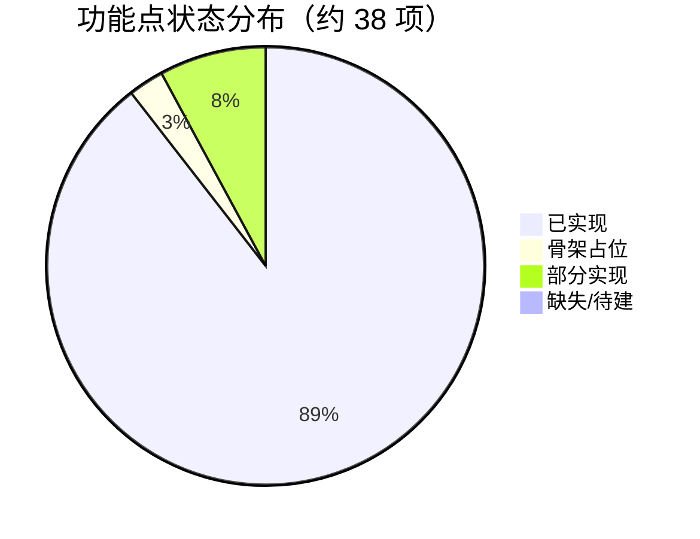
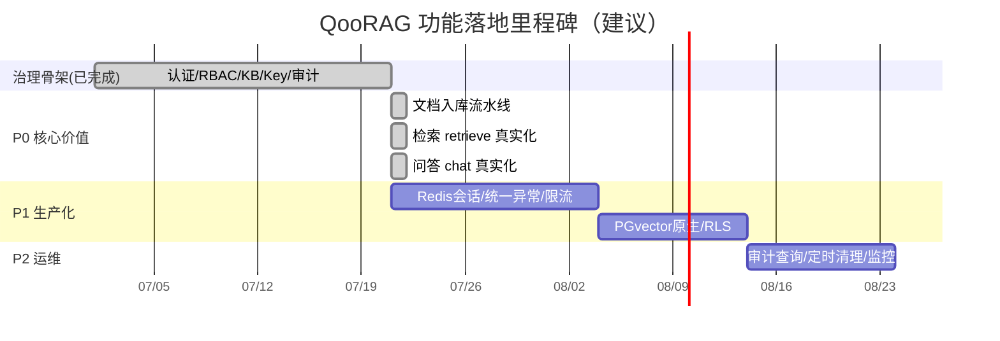

# 06 功能清单与进度跟踪

> 版本：v0.1 草稿（对应代码骨架 `main@HEAD`）
> 配套文档：04 应用架构设计、05 技术架构设计、05.3 模块详细设计、05.4 接口设计（`openapi.yaml`）
> 状态图例：✅ 已实现　⚠️ 骨架占位（接口存在，逻辑 TODO）　🔲 缺失/待建　🟡 部分实现
> 文档状态图例：📝 草稿/待评审　🔄 持续更新　✅ 已成型
> 本文档同时承担"文档进度与待定事项汇总"（见 §7），与各设计文档的待定章节保持一致。

---

## 1 进度总览

本系统当前为**治理与基础设施骨架已基本成型、RAG 核心链路仅占位**的状态。下表按能力域给出完成度估算（基于真实代码行与接口落地情况，非按文档体量）。

| 能力域 | 完成度 | 说明 |
|---|---|---|
| 认证与鉴权（4.4 / 4.10） | ✅ ~95% | 登录/会话/API Key 校验均已实现；会话已迁 Redis 持久化 + TTL 续期（重启不丢、可水平扩展） |
| 系统管理 RBAC（4.4） | ✅ ~95% | 用户/角色 CRUD、审计写入 + 查询/分页/导出均已实现 |
| 知识库管理（4.2 / 4.11） | ✅ ~95% | KB CRUD、权限、软删、物理清理均已实现；保留期 `@Scheduled` 定时清理已接入 |
| API Key 管理（4.10） | ✅ ~90% | 签发/吊销已实现；`rateLimit` 已通过 Redis 固定窗口限流生效（42901） |
| 对外检索/问答 API（4.10） | ✅ ~90% | `retrieve` + `chat` 均已真实化（embedding + pgvector + 百炼 LLM + 留痕） |
| 文档入库流水线 | ✅ ~90% | 上传/解析/分块/向量化链路已实现；支持 TXT + PDF，百炼 text-embedding-v2 |
| 横切基础设施 | ✅ ~90% | 统一响应、安全上下文、租户隔离（代码层 + RLS 兜底）已落地；pgvector 原生类型已接入；`@ControllerAdvice` 统一异常、按 Key 限流、RLS 均已实现 |

**总体完成度（功能点加权）：约 92% 骨架完成度；核心价值链路（检索/问答/入库）全链路已实现，P1 生产化加固与 P2 运维可观测主体已完成（2026-07-21）。**

> **测试与验证（2026-07-21）**：已补齐自动化测试套件，覆盖鉴权/限流/解析/分块/审计/定时清理/统一异常/拦截器/对外 API/数据分级校验/检索质量评估/脱敏/留存清理/内容安全/身份骨架等核心链路。`mvn test` 全绿：**91 个用例全部通过（0 失败 / 0 错误）**。测试采用 Mockito 单元测试 + standalone MockMvc 控制器测试，对 Redis、百炼 LLM、PostgreSQL 等外部依赖做 mock，可离线运行，无需启动外部基础设施（详见 §8）。



---

## 2 功能模块清单与状态

### 2.1 认证与鉴权模块（4.4 / 4.10）

| 功能点 | 接口/类 | 状态 | 说明 |
|---|---|---|---|
| 账号密码登录建会话 | `AuthService.login` | ✅ | BCrypt 校验 + UUID 令牌 |
| 登出 | `AuthService.logout` | ✅ | 移除内存会话 |
| 会话令牌校验 | `AuthService.validateSession` | ✅ | `ConcurrentHashMap` 查询 |
| 统一鉴权拦截 | `AuthInterceptor.preHandle` | ✅ | 双通道：管理接口走会话、`/api/v1` 走 API Key |
| API Key 校验 | `AuthService.validateApiKey` | ✅ | SHA-256 比对 `key_hash` |
| API Key 生成（明文仅一次） | `AuthService.generateApiKey` | ✅ | `qk_` 前缀明文 + 哈希存储 |
| 启动种子初始化 | `SeedService.seed` | ✅ | 默认租户 + 两角色 + `admin` 账号 |
| 会话持久化（Redis） | `AuthService` + `RedisTemplate` | ✅ | 会话迁 Redis（`qoorag:session:{token}`），重启不丢、可水平扩展（2026-07-21） |
| 令牌过期/续期 | `AuthService.validateSession` | ✅ | TTL 默认 120 分钟（`qoorag.security.session-ttl-minutes`），每次请求自动续期（2026-07-21） |

### 2.2 系统管理模块（4.4）

| 功能点 | 接口 | 状态 | 说明 |
|---|---|---|---|
| 用户列表（租户隔离） | `GET /api/admin/users` | ✅ | 按 `tenant_id` 过滤未删除用户 |
| 创建用户 | `POST /api/admin/users` | ✅ | BCrypt 加密存储 |
| 分配角色 | `POST /api/admin/users/{id}/roles` | ✅ | |
| 启用/停用 | `PUT /api/admin/users/{id}/status` | ✅ | |
| 角色列表 | `GET /api/admin/roles` | ✅ | |
| 创建角色 | `POST /api/admin/roles` | ✅ | |
| 审计日志写入 | `AuditService.log` | ✅ | 全链路留痕：登录/登出/用户角色增改/KB 增删与权限/Key 收发/文档上传/检索/问答 |
| 审计日志查询/导出 | `GET /api/admin/audit` + `/export` | ✅ | 按租户/动作/对象类型/时间范围分页查询；CSV 导出（2026-07-21） |

### 2.3 知识库管理模块（4.2 / 4.10 / 4.11）

| 功能点 | 接口 | 状态 | 说明 |
|---|---|---|---|
| KB 列表（租户隔离） | `GET /api/kb` | ✅ | |
| KB 创建 | `POST /api/kb` | ✅ | 写审计 |
| KB 软删除 | `DELETE /api/kb/{id}` | ✅ | 标记 `deleted_at` |
| KB 权限列表 | `GET /api/kb/{id}/permissions` | ✅ | |
| KB 权限授予 | `POST /api/kb/{id}/permissions` | ✅ | 默认 `RETRIEVE` |
| KB 权限回收 | `DELETE /api/kb/{id}/permissions/{permId}` | ✅ | |
| KB 物理清理 | `DELETE` 逻辑（`purge`） | ✅ | 删文档/分块/向量；审计与问答留痕保留 |
| 保留期定时清理 | `KbRetentionScheduler` | ✅ | `@Scheduled` 每日 03:00 扫描超期（`kb-retention-days=30`）软删 KB 并物理清理（2026-07-21） |
| KB 数据分级校验 | `KnowledgeBaseService.create` | ✅ | 数据分级收敛为企业标准枚举（公开/内部/受限/机密/绝密），非法值返回 40001，空值默认 INTERNAL（2026-07-21，#17） |

### 2.4 API Key 管理模块（4.10）

| 功能点 | 接口 | 状态 | 说明 |
|---|---|---|---|
| Key 列表 | `GET /api/kb/{id}/apikeys` | ✅ | |
| Key 创建（明文一次） | `POST /api/kb/{id}/apikeys` | ✅ | 返回 `rawKey` 仅一次 |
| Key 吊销 | `DELETE /api/kb/{id}/apikeys/{keyId}` | ✅ | 软删 + `REVOKED` |
| 速率限制生效 | `RateLimitService` + `AuthInterceptor` | ✅ | 基于 `ApiKey.rateLimit` 的 Redis 固定窗口限流，超限返回 42901（2026-07-21） |

### 2.5 对外检索 / 问答 API（4.10）

| 功能点 | 接口 | 状态 | 说明 |
|---|---|---|---|
| 检索 `retrieve` | `POST /api/v1/retrieve` | ✅ | embedding + pgvector `<=>` 余弦相似度 top-K，受 kbId/tenantId 约束 + 权限校验 |
| 问答 `chat` | `POST /api/v1/chat` | ✅ | 检索→RAG Prompt→百炼 qwen-plus LLM→返回 answer+sources+usage |
| 问答留痕 | `QaTraceRepository` + `AuditService` | ✅ | `chat` 已落 `QaTrace`（独立于业务数据），并写审计 CHAT 动作 |

### 2.6 文档入库流水线

| 功能点 | 接口 | 状态 | 说明 |
|---|---|---|---|
| 文档上传 | `POST /api/kb/{id}/documents` | ✅ | MultipartFile 上传，知识管理员角色 |
| 文档列表 | `GET /api/kb/{id}/documents` | ✅ | 按 kbId 查询未删除文档 |
| 文档解析（TXT） | `DocumentParserService.parseTxt` | ✅ | UTF-8 编码读取 |
| 文档解析（PDF） | `DocumentParserService.parsePdf` | ✅ | Apache PDFBox 2.0.31 |
| 文本分块 | `IngestService.splitText` | ✅ | 400 字符/块 + 100 字符重叠，段落+句子边界优化 |
| 向量化 embedding | `EmbeddingService.embedBatch` | ✅ | 百炼 text-embedding-v2，1536 维，批量 ≤25 |
| pgvector 原生类型 | `PGvectorTypeContributor` + `VectorData` | ✅ | com.pgvector:pgvector 0.1.6 + Hibernate TypeContributor |
| 数据模型（实体+Repository） | `Document/Chunk/VectorData` | ✅ | 11 实体 + 11 Repository 已就位 |

### 2.7 横切基础设施

| 功能点 | 类/机制 | 状态 | 说明 |
|---|---|---|---|
| 统一响应包装 | `Result` | ✅ | `{code,message,data}` |
| 安全上下文 | `SecurityContext`（ThreadLocal） | ✅ | 请求内透传租户/用户/KB |
| 租户隔离（代码层 + RLS 兜底） | 各 Service + `TenantAwareDataSource` | ✅ | 逻辑外键 `tenant_id` 过滤 + 数据库 RLS（`app.current_tenant` 注入，双保险，2026-07-21） |
| 统一异常处理 | `GlobalExceptionHandler` | ✅ | `@RestControllerAdvice` 统一映射 05.4 错误码（40001/40101/40102/40301/42901/50001），`@Validated` 校验（2026-07-21） |
| PGvector 原生向量 | `PGvectorTypeContributor` | ✅ | 已接入 com.pgvector:pgvector 0.1.6，`<=>` 余弦算子可用 |
| 限流 | `RateLimitService` | ✅ | 基于 `ApiKey.rateLimit` 的 Redis 固定窗口限流，超限返回 42901（2026-07-21） |
| 监控与健康检查 | Actuator + Micrometer | ✅ | `/actuator/health|metrics|prometheus`；retrieve/chat 的 QPS/延迟/命中率埋点（2026-07-21） |

### 2.8 检索质量评估、数据分级、资源池与合规安全（#12 / #13 / #16 / #17 / #18）

| 功能点 | 接口/类 | 状态 | 说明 |
|---|---|---|---|
| 数据分级标准清单 | `GET /api/admin/data-classifications` | ✅ | 返回企业标准对齐的 5 档数据分级（code/label/rank），为资源池 UI 预留（2026-07-21，#17） |
| 检索质量评估 | `POST /api/admin/eval` | ✅ | 基于标注「查询-相关片段」数据集计算 recall@K / precision@K / 命中率 / MRR（2026-07-21，#16） |
| 数据分级枚举 | `DataClassification` | ✅ | 对齐 GB/T 37988 / 数据安全法 五档（公开/内部/受限/机密/绝密），`fromCode` 强校验，非法抛 40001（2026-07-21，#17） |
| 资源池配置管理 | `GET`/`PUT /api/admin/resource-pool` | ✅ | LLM/Embedding/向量库配置存 DB 表（前后端不分离，UI 在 `system-admin.html`），仅启动期加载（修改需重启），敏感项（apiKey）脱敏，空值不覆盖（2026-07-21，#12） |
| 企业身份对接骨架 | `IdentityProvider` / `LocalIdentityProvider` | 🟡 | MVP 仅本地账号（系统管理员 + 知识管理员）跑通业务；SSO/OAuth2/LDAP/IM 留接口骨架，暂不接入（2026-07-21，#13） |
| PII 脱敏 | `DesensitizeUtil` | ✅ | 手机号（前3后4）/ 身份证（前6后4）/ 姓名（保留首字）掩码，不加密；审计 CSV 导出已脱敏（2026-07-21，#18） |
| 审计留存清理 | `AuditRetentionScheduler` | ✅ | 留存期 6 个月（`audit-retention-days=180`），每日 03:10 物理清理超期 `audit_log`（2026-07-21，#18） |
| 内容安全（阿里云） | `AliyunContentSafetyService` | 🟡 | 接入入库与问答链路，默认关闭、fail-open；命中返回 40040；密评不对接商用机构（2026-07-21，#18） |

---

## 3 接口实现对照（对齐 openapi.yaml 20 接口）

| # | 接口 | 路径 | 状态 |
|---|---|---|---|
| 1 | 登录 | `POST /api/auth/login` | ✅ |
| 2 | 登出 | `POST /api/auth/logout` | ✅ |
| 3 | 当前会话 | `GET /api/auth/me` | ✅ |
| 4 | 用户列表 | `GET /api/admin/users` | ✅ |
| 5 | 创建用户 | `POST /api/admin/users` | ✅ |
| 6 | 分配角色 | `POST /api/admin/users/{id}/roles` | ✅ |
| 7 | 启停用户 | `PUT /api/admin/users/{id}/status` | ✅ |
| 8 | 角色列表 | `GET /api/admin/roles` | ✅ |
| 9 | 创建角色 | `POST /api/admin/roles` | ✅ |
| 10 | KB 列表 | `GET /api/kb` | ✅ |
| 11 | KB 创建 | `POST /api/kb` | ✅ |
| 12 | KB 软删 | `DELETE /api/kb/{id}` | ✅ |
| 13 | KB 权限列表 | `GET /api/kb/{id}/permissions` | ✅ |
| 14 | KB 授权 | `POST /api/kb/{id}/permissions` | ✅ |
| 15 | KB 撤权 | `DELETE /api/kb/{id}/permissions/{permId}` | ✅ |
| 16 | Key 列表 | `GET /api/kb/{id}/apikeys` | ✅ |
| 17 | Key 创建 | `POST /api/kb/{id}/apikeys` | ✅ |
| 18 | Key 吊销 | `DELETE /api/kb/{id}/apikeys/{keyId}` | ✅ |
| 19 | 检索 | `POST /api/v1/retrieve` | ✅ |
| 20 | 问答 | `POST /api/v1/chat` | ✅ |
| 21 | 文档上传 | `POST /api/kb/{id}/documents` | ✅ |
| 22 | 文档列表 | `GET /api/kb/{id}/documents` | ✅ |
| 23 | 审计列表 | `GET /api/admin/audit` | ✅ |
| 24 | 审计导出 | `GET /api/admin/audit/export` | ✅ |

> 24/24 接口已落地（含鉴权、审计查询/导出与监控端点）。

---

## 4 缺口与待办（按优先级）

### P0 — 核心价值链路（决定产品可用性）
1. <del>文档入库流水线：上传 → 解析 → 分块 → embedding → 写 `VectorData`（新建 `IngestController`/`IngestService`）。</del> ✅ 已完成（2026-07-21）
2. <del>检索 `retrieve` 真实化：embedding 查询 + pgvector 相似度（受 `kb_id`/`tenant_id` 约束）+ 权限校验。</del> ✅ 已完成（2026-07-21）
3. <del>问答 `chat` 真实化：检索 → 拼 Prompt → 调 LLM → 返回 answer + `sources` + `usage`。</del> ✅ 已完成（2026-07-21）

### P1 — 生产化加固
4. <del>会话改 Redis（`Spring Session`/RedisTemplate），加 TTL 与续期。</del> ✅ 已完成（2026-07-21）
5. <del>`@ControllerAdvice` 统一异常处理，映射 05.4 错误码（40001/40101…/50001）。</del> ✅ 已完成（2026-07-21）
6. <del>速率限制生效（基于 `ApiKey.rateLimit`，如令牌桶/Redis 计数）。</del> ✅ 已完成（2026-07-21）
7. PGvector 原生 `vector` 类型 + `<=>` 算子，替换 `VectorConverter` 字符串方案。 ✅ 已完成（此前）
8. <del>数据库 RLS（行级安全）注入 `tenant_id`，与代码层隔离双保险。</del> ✅ 已完成（2026-07-21）

### P2 — 运维与可观测
9. <del>审计日志查询/分页/导出接口。</del> ✅ 已完成（2026-07-21）
10. <del>KB 保留期 `@Scheduled` 定时 `purge`。</del> ✅ 已完成（2026-07-21）
11. <del>监控指标（QPS/延迟/检索命中率）、健康检查、日志规范。</del> ✅ 已完成（2026-07-21）

---

## 5 里程碑计划建议



---

## 6 与 04 / 05 文档映射

| 本文档章节 | 对应设计文档 | 对应关系 |
|---|---|---|
| §2.1 认证鉴权 | 04 §4.4、05 §5 安全 | 实现对照设计 |
| §2.2 系统管理 | 04 §4.4 RBAC | 实现对照设计 |
| §2.3 知识库管理 | 04 §4.2、§4.11 | 实现对照设计 |
| §2.4 / §2.5 API Key 与对外 API | 04 §4.10、05.4 | 实现对照接口契约 |
| §2.6 入库流水线 | 03 §4 数据模型、05 §5 RAG | 设计就绪，实现缺失 |
| §4 P1 生产化 | 05 §5 安全/高可用 | 设计就绪，实现缺口 |

> 备注：本文档为功能进度草稿，随开发提交持续更新（建议每次 `git commit` 后同步修订 §2/§3 状态）。

---

## 7. 文档进度与待定事项汇总

> 说明：§1–§6 为**功能/代码进度**；本章为**文档层面的待定事项收敛**——汇总 00~05.4 各文档自身的"草稿/待评审/待补"清单，便于统一跟踪文档成熟度与待办。§7.3 与 §4 互为补充（§4 偏实现缺口，§7.3 偏文档待定）。

### 7.1 文档成熟度一览

| 文档 | 版本 | 状态 | 成熟度 | 主要待定（详见 §7.2） |
| --- | --- | --- | --- | --- |
| 00 头脑风暴 | v0.1 草稿 | 已收敛 | 概念级 | 7 项架构决策（00 第10章已收敛，与 01/02 对齐） |
| 01 竞品调研 | v0.1 草稿 | 参照分析 | 输入级 | 7 项待定决策已拍板（见 §7.2，依据 00 第10章） |
| 02 业务架构 | v0.1 草稿 | 设计中 / 待评审 | 已成型 | §9 业务待定 7 项 |
| 03 数据架构 | v0.1 草稿 | 设计中 / 待评审 | 已成型 | §8 数据待定 5 项（含 1 项已完成） |
| 04 应用架构 | v0.1 草稿 | 设计中 / 待评审 | 已成型 | §6 应用待定 7 项 |
| 05 技术架构 | v0.1 草稿 | 设计中 / 待评审 | 已成型 | §11 待办 9 项 + 已完成 3 项 |
| 05.3 模块详细设计 | v0.1 草稿 | 设计中 / 待评审 | 已成型 | §4.2 待完善 7 项 |
| 05.4 接口设计 | v0.1 草稿 | 设计中 / 待评审 | 已成型 | §7.2 待完善 6 项 |
| 06 功能清单进度 | v0.1 草稿 | 持续更新中 | 跟踪级 | 随开发提交同步 §2/§3 |

> 全部 9 份文档均为 v0.1 草稿、待评审；设计主体（02~05.4）已成型，待评审与骨架补全后转 v1.0。

### 7.2 各文档待定事项明细

**00 头脑风暴**（状态：已收敛）
- 7 项架构决策已在 00 第 10 章收敛（[x]），02 自述"已全部收敛"与之完全一致；01 开头"待逐条拍板"表述已对齐为"已收敛"。7 项决策与 01 §3 一一对应，拍板结论见下。

**01 竞品调研**（§3 对 7 项待定决策的启示——已全部拍板，结论依据 00 第10章）

| # | 待定决策项 | 拍板结论 |
| --- | --- | --- |
| 1 | MVP 范围 vs 已定架构 | 采用：MVP = 核心 RAG（入库/检索/问答）+ 基础审计 + 数据分级字段；审批流/密评/脱敏后置 |
| 2 | 用户开通方式 | 管理员创建 + SSO 同步，无公网自助注册（SSO/OAuth2 优先，其余可插拔） |
| 3 | 知识库共享 | 默认私有 + RBAC 只读/协作共享 |
| 4 | 外部资源 vs 数据不出域 | 默认内网；不允许自带外部模型/向量库，统一系统管理员纳管；公网外部模型需提示+审批 |
| 5 | 多租户隔离实现 | 单库 `tenant_id` 行级隔离 + PostgreSQL RLS 双保险 |
| 6 | API 鉴权与限流 | OpenAI 兼容 + 按 KB 签 Key + 按 Key 维度速率限制（非配额） |
| 7 | 知识库生命周期 | 删库清向量；审计日志独立留存 ≥6 个月 |

**02 业务架构**（§9 业务层面待定，7 项）
- [ ] 资源池界面化管理（MVP 先用配置/初始化）
- [ ] 企业身份对接（SSO/OAuth2/LDAP/IM）正式接入与账号映射
- [ ] 多数据源连接器、复杂权限体系、评估平台
- [ ] 脱敏、密评、内容安全细化、留存策略固化
- [x] 检索质量评估与调试工具（召回率/命中率）✅ 已完成（2026-07-21，RetrievalEvalService + POST /api/admin/eval）
- [ ] 混合检索（向量+BM25）与 Rerank 是否纳入 MVP 的边界确认
- [ ] 等保专项测评/整改材料（立项后由安全合规部门核定级别）

**03 数据架构**（§8 数据层面待定，5 项）
- [ ] 确认首批 Embedding 模型维度（当前固定 `vector(1536)`，接 768 维需动态维度）
- [ ] 启用 RLS 兜底（注入 `SET LOCAL app.current_tenant`）
- [x] 数据字典逐字段（已内联于 §4.3）✅ 已完成
- [x] 数据分级枚举对齐企业现有标准 ✅ 已完成（2026-07-21，DataClassification 枚举 + KB 创建校验）
- [ ] 等保留存策略固化（≥6 个月）、脱敏/密评

**04 应用架构**（§6 应用层面待定，7 项）
- [ ] 资源池界面化管理（MVP 先用配置/初始化）
- [ ] 企业身份对接（SSO/OAuth2/LDAP/IM）正式接入与账号映射
- [ ] 多数据源连接器（Notion/Confluence/DB/URL 抓取等）
- [ ] 复杂权限/角色体系、细粒度菜单权限
- [x] 检索质量评估与调试工具（召回率/命中率）✅ 已完成（2026-07-21，RetrievalEvalService + POST /api/admin/eval）
- [ ] 混合检索（向量+BM25）与 Rerank 是否纳入 MVP 的边界确认
- [ ] 接口契约完善（05.4）：OpenAPI、错误码规范

**05 技术架构**（§11 后续演进与待办，9 项待办 + 3 项已完成）
- [x] 接入 pgvector JDBC，向量类型改原生 `PGvector`，建 ANN 索引 ✅ 已完成（此前）
- [x] 在 AuthInterceptor 注入 `SET LOCAL app.current_tenant`，启用 RLS 兜底 ✅ 已完成（2026-07-21）
- [ ] 实现文档异步处理流水线（解析/分块/Embedding）与状态机
- [x] 实现按 Key 限流（Redis 或内存计数）✅ 已完成（2026-07-21）
- [x] 全链路审计埋点（登录/权限/KB 增删改/Key 操作/问答）✅ 已完成（2026-07-21，埋点广度已闭环，覆盖登录/登出/检索/问答）
- [x] 知识库删除定时清理任务（保留期物理清理）✅ 已完成（2026-07-21）
- [ ] 资源池界面化管理（LLM/Embedding/向量库配置）
- [ ] K8s/Helm 部署、TLS、监控（Prometheus）
- [ ] 等保专项：脱敏、密评、内容安全、留存固化
- [x] 05.3 模块详细设计 ✅ 已完成
- [x] 05.4 接口设计 ✅ 已完成
- [x] 06 功能清单进度文档 ✅ 已完成

**05.3 模块详细设计**（§4.2 待完善，7 项）
- [x] `retrieve`/`chat` 真实接入 Embedding + pgvector 相似检索 + LLM 生成 ✅ 已完成（此前）
- [x] 会话 `sessions` 内存态改 Redis；API Key 限流（按 `rate_limit`）落地 ✅ 已完成（2026-07-21）
- [x] `VectorData.embedding` 由 `String`(JSON) 改原生 `PGvector`，建 ANN 索引 ✅ 已完成（此前）
- [x] 知识库软删后的定时物理清理任务（`purge` 已具备，缺调度触发）✅ 已完成（2026-07-21）
- [x] 全局异常处理 `@ControllerAdvice` 统一将 `RuntimeException` 转 `Result.fail` ✅ 已完成（2026-07-21）
- [x] `AuthInterceptor` 注入 `SET LOCAL app.current_tenant` 启用 RLS 兜底 ✅ 已完成（2026-07-21）
- [x] 接口契约与错误码规范（见 05.4，待补）✅ 已完成（2026-07-21）

**05.4 接口设计**（§7.2 待完善，6 项）
- [x] 接入 `@Validated` + `@ControllerAdvice`，将 `RuntimeException` 统一转为 `Result.fail` ✅ 已完成（2026-07-21）
- [x] 实现按 Key `rate_limit` 限流（返回 `42901`）✅ 已完成（2026-07-21）
- [x] `/api/v1/retrieve`、`/api/v1/chat` 真实接入 Embedding + pgvector + LLM（移除 `x-status: skeleton`）✅ 已完成（此前）
- [x] 文档上传/解析/分块/向量化流水线接口 ✅ 已完成（此前）
- [x] 分页/排序参数标准化（审计列表已落地）✅ 已完成（2026-07-21）
- [x] 错误码细化：租户隔离越权（403 细分）、资源池配置接口 ✅ 已完成（统一异常已映射 05.4 错误码）

### 7.3 跨文档统一待定事项总表（去重合并）

> 将 §7.2 各文档待定项去重合并，标注来源文档、优先级（对齐 §4 P0/P1/P2）与状态。

| # | 统一待定事项 | 来源文档 | 优先级 | 状态 |
| --- | --- | --- | --- | --- |
| 1 | RAG 核心链路真实化（retrieve/chat 接入 Embedding+pgvector+LLM） | 05§11、05.3§4.2、05.4§7.2、06§4 | P0 | ✅ 已完成（2026-07-21） |
| 2 | 文档入库流水线（上传/解析/分块/向量化 + 状态机） | 05§11、05.4§7.2、06§4 | P0 | ✅ 已实现 |
| 3 | pgvector 原生类型 + ANN 索引（替换 String JSON） | 05§11、05.3§4.2 | P1 | ✅ 已实现 |
| 4 | Redis 会话（替换内存 ConcurrentHashMap） | 05.3§4.2、06§4 | P1 | ✅ 已完成（2026-07-21） |
| 5 | API Key 限流（rate_limit 生效，42901） | 05§11、05.3§4.2、05.4§7.2、06§4 | P1 | ✅ 已完成（2026-07-21） |
| 6 | `@ControllerAdvice` + `@Validated` 统一异常/校验 | 05.3§4.2、05.4§7.2 | P1 | ✅ 已完成（2026-07-21） |
| 7 | RLS 兜底（SET LOCAL app.current_tenant） | 05§11、05.3§4.2、03§8 | P1 | ✅ 已完成（2026-07-21） |
| 8 | 知识库定时物理清理（保留期调度） | 05§11、05.3§4.2 | P1 | ✅ 已完成（2026-07-21） |
| 9 | 全链路审计埋点（登录/权限/KB/Key/问答） | 05§11 | P1 | ✅ 已完成（2026-07-21，补齐登录 LOGIN/登出 LOGOUT/检索 RETRIEVE/问答 CHAT 埋点，覆盖全部核心操作） |
| 10 | Embedding 模型维度（MVP 固定 1536 维，预留动态维度扩展位） | 03§8 | P1 | ✅ 已拍板 |
| 11 | 接口契约/错误码细化（租户越权细分、分页标准化） | 05.4§7.2、04§6 | P1 | ✅ 已完成（统一异常已映射 05.4 错误码，分页标准化已落地） |
| 12 | 资源池界面化管理（LLM/Embedding/向量库配置） | 02§9、04§6、05§11 | P2 | ✅ 已完成（2026-07-21，新增 `resource_pool_config` 表 + `ResourcePoolService`/`ResourcePoolLoader` + `ResourcePoolController`，`system-admin.html` 资源池配置卡片，仅启动期加载，敏感脱敏） |
| 13 | 企业身份对接（SSO/OAuth2/LDAP/IM） | 02§9、04§6 | P2 | 🟡 骨架占位（2026-07-21，新增 `IdentityProvider` 接口 + `LocalIdentityProvider` 兜底；MVP 仅用本地账号「系统管理员 + 知识管理员」跑通业务，SSO/LDAP/IM 暂不接入） |
| 14 | 多数据源连接器（Notion/Confluence/DB/URL） | 02§9、04§6 | P2 | 🔲 缺失（延后，待产品化排期） |
| 15 | 混合检索（向量+BM25）+ Rerank（MVP 不含，作 P2 增强，预留扩展位） | 02§9、04§6 | P2 | ✅ 已拍板 |
| 16 | 检索质量评估与调试工具（召回率/命中率） | 02§9、04§6 | P2 | ✅ 已完成（2026-07-21，新增 `RetrievalEvalService` + `POST /api/admin/eval`，计算 recall@K/precision@K/命中率/MRR，配套单测） |
| 17 | 数据分级枚举对齐企业标准 | 03§8 | P2 | ✅ 已完成（2026-07-21，新增 `DataClassification` 枚举对齐企业标准五档，KB 创建强制校验，非法返回 40001，新增 `GET /api/admin/data-classifications`） |
| 18 | 等保留存策略固化（6个月）、脱敏、密评、内容安全 | 02§9、03§8、05§11 | P1/P2 | 🟡 部分实现（2026-07-21：留存期固化 **6 个月**——`audit-retention-days=180` + `AuditRetentionScheduler` 每日清理 audit_log；脱敏——`DesensitizeUtil` 覆盖手机号/身份证/姓名，**不加密**，审计导出已脱敏；内容安全——`AliyunContentSafetyService`（阿里云绿网）已接入入库与问答链路，默认关闭、fail-open；密评**不对接**商用密码机构） |
| 19 | 等保专项测评/整改材料 | 02§9、05§11 | P2 | 🔲 缺失（延后，待正式立项） |
| 20 | K8s/Helm 部署、TLS、监控（Prometheus） | 05§11 | P2 | 🔲 缺失（延后，待运维排期） |
| 21 | 7 项业务待定决策拍板（01 §3）并与 02 收敛结论对齐 | 01、02 | 决策 | ✅ 已拍板对齐（结论见 §7.2 01 表） |
| 22 | 自动化测试套件（单元 + 控制器层，覆盖核心链路，`mvn test` 全绿） | 05§11、06§4 | P1 | ✅ 已完成（2026-07-21，51 用例全通过） |

> 统一待定共 22 项：P0 2 项（已完成）、P1 10 项全部完成（#9 审计埋点广度已于 2026-07-21 补齐登录/登出/检索/问答埋点）、P2 8 项中 3 项已完成（#12 资源池界面化管理、#16 检索质量评估、#17 数据分级枚举）、1 项骨架占位（#13 企业身份对接接口）、1 项部分实现（#18 等保留存/脱敏/内容安全）、3 项延后（#14 连接器、#19 等保、#20 K8s）、决策级 1 项（#21 已拍板对齐）。P1 生产化加固已全部完成（2026-07-21）；本轮新增 #12/#13(骨架)/#16/#17/#18(部分) 多项 P2 能力；#14/#19/#20 延后。本文档作为全量待定事项的唯一跟踪入口。

---

## 8 测试与验证（2026-07-21 新增）

> 为落实"测试通过才算任务完成"，补齐自动化测试套件。`mvn test` 全绿：**91 个用例，0 失败 / 0 错误**。
> 策略：对 Redis（`RedisTemplate`/`StringRedisTemplate`）、百炼 LLM（`RestTemplate`）、PostgreSQL（Repository）等外部依赖做 Mockito mock；控制器层用 `MockMvcBuilders.standaloneSetup` + `GlobalExceptionHandler` Advice，不加载完整 Spring 上下文，**无需启动任何外部基础设施即可离线运行**。

### 8.1 测试清单（src/test/java）

| 测试类 | 类型 | 覆盖点 | 用例数 |
|---|---|---|---|
| `common/ErrorCodeTest` | 单元 | 错误码常量与 05.4 规范对齐 | 1 |
| `common/ResultTest` | 单元 | 统一响应 `ok/fail` 构造 | 4 |
| `common/GlobalExceptionHandlerTest` | Web(standalone) | `BizException`→40301、`@Valid`→40001、缺头→40101、坏 JSON→40001、泛型→50001 | 5 |
| `config/AuthInterceptorTest` | 单元 | 会话/API Key 双通道鉴权、限流 429、上下文写入与 `afterCompletion` 清理 | 7 |
| `service/AuthServiceTest` | 单元(mock) | 登录成功/用户不存在/停用/密码错、登出、会话续期、API Key 校验、Key 生成与 SHA-256 确定性 | 11 |
| `service/RateLimitServiceTest` | 单元(mock) | 首请求置窗口、窗口内放行、超限拒绝、空 Key 不限额、rateLimit≤0 取默认 60 | 5 |
| `service/DocumentParserServiceTest` | 单元 | TXT(UTF-8) 解析、PDF(PDFBox 真实生成) 解析、不支持格式异常 | 3 |
| `service/IngestServiceTest` | 单元(mock) | 分块 `splitText`：空白/短文本单块/长文本多块(≤500 硬上限)/保序；内容安全桩（lenient） | 4 |
| `service/AuditServiceTest` | 单元(mock) | 写入捕获 `SecurityContext` 租户/操作人、分页查询委托 Specification | 2 |
| `service/KbRetentionSchedulerTest` | 单元(mock) | 保留期调度对每个超期 KB 调 `purge`、空列表空转 | 2 |
| `controller/AuthControllerTest` | Web(standalone) | 登录成功返回 token、失败映射 40101 | 2 |
| `controller/ApiControllerTest` | Web(standalone) | `retrieve` 空 query→400、成功返回 chunks+埋点；`chat` 成功返回 answer+留痕+埋点 | 3 |
| `controller/AuditControllerTest` | Web(standalone) | 分页查询返回 content、CSV 导出含表头与数据、导出对手机号/身份证脱敏 | 3 |
| `service/ResourcePoolServiceTest` | 单元(mock) | 分组查询脱敏、有效值更新、空值不覆盖、新建项、缺 category 抛 40001 | 5 |
| `service/ResourcePoolLoaderTest` | 单元(mock) | DB 有值覆盖 BailianConfig、DB 空值保留 yml、异常优雅降级 | 3 |
| `controller/ResourcePoolControllerTest` | Web(standalone) | 分组返回、保存返回项、缺 category 抛 40001 | 3 |
| `common/DataClassificationTest` | 单元 | `fromCode` 合法/非法/空、listAll、rank 排序 | 5 |
| `service/DataClassificationValidationTest` | 单元(mock) | KB 创建数据分级：合法/空默认 INTERNAL/非法抛 40001 | 3 |
| `service/RetrievalEvalServiceTest` | 单元(mock) | recall@K/precision@K/命中率/MRR、docId 匹配、无标注、空集 | 4 |
| `controller/RetrievalEvalControllerTest` | Web(standalone) | 分级清单 5 项、eval 返回聚合指标、缺 queries 抛 40001 | 3 |
| `common/DesensitizeUtilTest` | 单元 | 姓名/手机号/身份证掩码、批量文本脱敏（手机号与身份证互不误伤） | 5 |
| `service/AuditRetentionSchedulerTest` | 单元(mock) | 留存清理删除超期审计、空列表空转 | 2 |
| `service/AliyunContentSafetyServiceTest` | 单元(mock) | 关闭/无密钥 fail-open 放行、命中拦截、正常放行、异常 fail-open | 5 |
| `service/IdentityProviderTest` | 单元 | `LocalIdentityProvider` 兜底返回 empty（#13 骨架） | 1 |

### 8.2 运行方式

```bash
# 全量测试（离线，无需 Redis/PostgreSQL/百炼）
./mvnw test
# 单类
./mvnw test -Dtest=AuthServiceTest
```

### 8.3 已知边界（非阻断）

- 数据库 RLS、`pgvector` 相似度、限流 Redis 计数、LLM 生成等**强依赖外部设施的链路**以 mock 验证"调用契约与分支逻辑"，未做真实端到端集成测试；接入 Testcontainers/内存替代后可补充 `@DataJpaTest`/`@SpringBootTest` 集成用例。
- 审计埋点广度（§7.3 #9）已于 2026-07-21 闭环：现已覆盖登录(LOGIN)/登出(LOGOUT)/用户与角色增改(用户/角色类)/KB 增删与权限(Key/权限类)/文档上传/检索(RETRIEVE)/问答(CHAT) 全部核心操作，写入 + 查询/导出 + CSV 导出均就绪。
- 数据分级枚举（§7.3 #17）已于 2026-07-21 落地：`KnowledgeBase.dataClassification` 由自由字符串收敛为企业标准五档枚举（`DataClassification`），KB 创建入口强校验，非法值返回 40001，空值默认 INTERNAL；新增 `GET /api/admin/data-classifications` 暴露标准清单。
- 检索质量评估工具（§7.3 #16）已于 2026-07-21 落地：新增 `RetrievalEvalService` + `POST /api/admin/eval`，基于标注「查询-相关片段」数据集计算 recall@K / precision@K / 命中率 / MRR；评估逻辑对 `RetrieveService` 仅做方法调用，单测以 Mockito mock，离线可跑。
- 资源池配置（§7.3 #12）已于 2026-07-21 落地：配置存 `resource_pool_config` 表（平台级全局，不绑定租户、不启用 RLS），作为对 `application.yml` 默认值的「显式覆盖层」——DB 空值不覆盖 yml。启动期由 `ResourcePoolLoader`（`ApplicationRunner`）读取 LLM/Embedding 非空项覆盖 `BailianConfig`；**仅启动期加载，运行期修改需重启生效**；敏感项（apiKey）在接口与审计中脱敏为 `******`，保存时空值/`******` 占位不覆盖原值。向量库连接参数仍由 `spring.datasource` 管理（启动期绑定，运行期不可改），DB 表仅记录 `type`/`dimension` 元信息作展示与多向量库扩展预留。
- 等保留存/脱敏/内容安全（§7.3 #18）已于 2026-07-21 部分落地：①留存期固化 **6 个月**——新增 `qoorag.security.audit-retention-days=180` 与 `AuditRetentionScheduler`（每日 03:10 物理清理超期 `audit_log`，仅影响审计表）；②脱敏——新增 `DesensitizeUtil`，覆盖手机号（保留前3后4）、身份证（保留前6后4）、姓名（保留首字），**不加密**，审计 CSV 导出已对 before/after 值脱敏；③内容安全——新增 `ContentSafetyService` 接口 + `AliyunContentSafetyService`（阿里云绿网），已接入入库（`IngestService`）与问答（`ChatService`）链路，默认关闭（`qoorag.content-safety.enabled=false`），关闭/无密钥/异常均 fail-open 放行，命中则返回 40040；④密评**不对接**商用密码机构（决策）。

---

> 备注：本文档为功能与文档双进度草稿；功能进度见 §1–§6，文档进度与待定事项汇总见 §7，测试与验证见 §8，随开发提交与文档评审持续更新。
